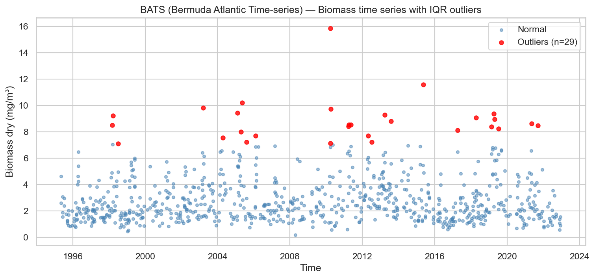
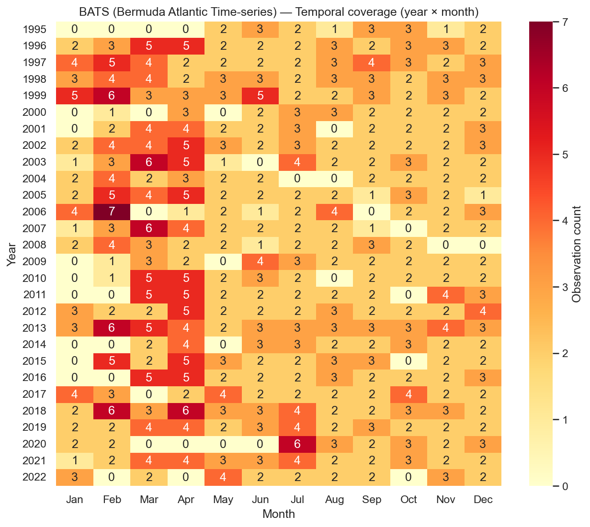
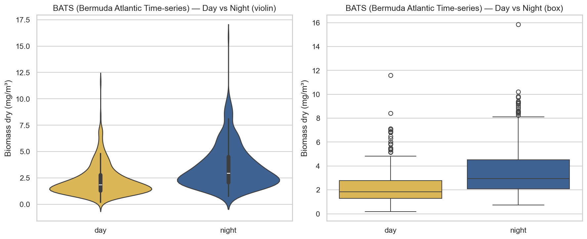
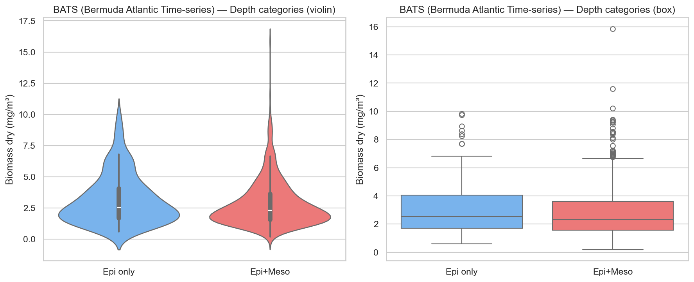
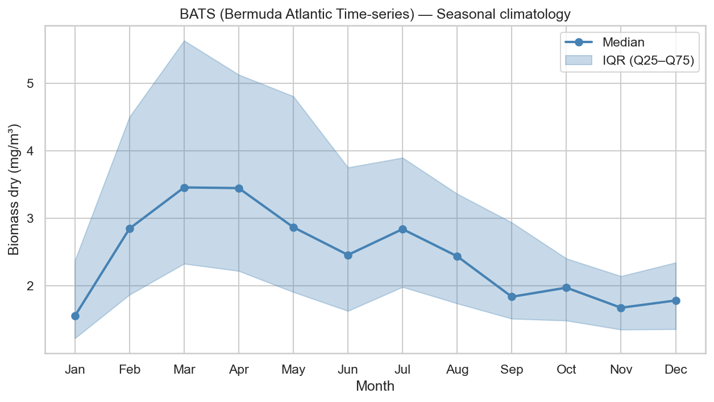
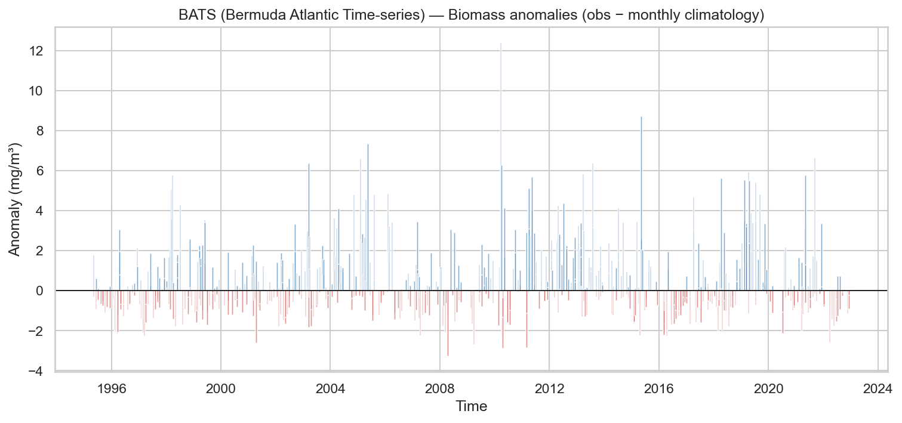
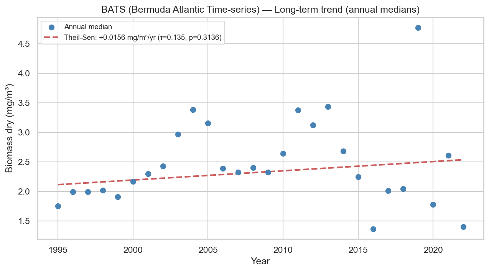

# Statistical Analysis — BATS (Bermuda Atlantic Time-series)

**Station**: bats  
**Source**: `bats_zooplankton_obs.nc`  
**Observations**: 810 (after dropping NaN biomass)  
**Period**: 1995-05-10 to 2022-12-13  

---

## 1. Outlier Detection (IQR × 1.5)

- Total observations: 810
- Outliers detected: 29
- Outlier fraction: 3.6%
- Biomass Q1: 1.5813 mg/m³
- Biomass Q3: 3.7837 mg/m³

## 2. Temporal Coverage

- Year range: 1995–2022
- Months with 0 observations (gaps): 39
- Median monthly observation count: 2.0

## 3. Day/Night Bias

| Metric | Day | Night |
|--------|-----|-------|
| N | 388 | 422 |
| Median (mg/m³) | 1.8375 | 2.9525 |
| Mean (mg/m³) | 2.2438 | 3.5337 |

- Night/Day median ratio: 1.61
- Mann-Whitney U p-value: 9.18e-31 (**)

## 4. Depth Category Bias

| Metric | Epipelagic only | Epi + Mesopelagic |
|--------|----------------|-------------------|
| N | 174 | 636 |
| Median (mg/m³) | 2.5250 | 2.3250 |
| Mean (mg/m³) | 3.1840 | 2.8424 |

- Meso/Epi median ratio: 0.92
- Mann-Whitney U p-value: 0.0571

## 5. Seasonal Climatology

Monthly median biomass (mg/m³):

| Month | Median | Q25 | Q75 | N |
|-------|--------|-----|-----|---|
| Jan | 1.5550 | 1.2250 | 2.3762 | 48 |
| Feb | 2.8500 | 1.8700 | 4.5050 | 81 |
| Mar | 3.4600 | 2.3300 | 5.6350 | 87 |
| Apr | 3.4500 | 2.2225 | 5.1300 | 95 |
| May | 2.8700 | 1.9100 | 4.8100 | 57 |
| Jun | 2.4600 | 1.6300 | 3.7550 | 63 |
| Jul | 2.8425 | 1.9850 | 3.9000 | 72 |
| Aug | 2.4400 | 1.7412 | 3.3650 | 60 |
| Sep | 1.8400 | 1.5150 | 2.9400 | 61 |
| Oct | 1.9750 | 1.4875 | 2.4062 | 60 |
| Nov | 1.6775 | 1.3538 | 2.1450 | 62 |
| Dec | 1.7850 | 1.3600 | 2.3463 | 64 |

## 6. Long-term Trend

- Number of years: 28
- Theil-Sen slope: +0.0156 mg/m³/year
- Mann-Kendall τ: 0.135
- Mann-Kendall p-value: 0.3136

## Extra — Biomass Wet

- Observations: 808
- Median: 14.0200 mg/m³
- Mean: 18.3686 mg/m³
- Theil-Sen slope: +0.1335 mg/m³/year
- Mann-Kendall p-value: 0.3564

---

*Report generated by `src/core/analyze_station.py`*