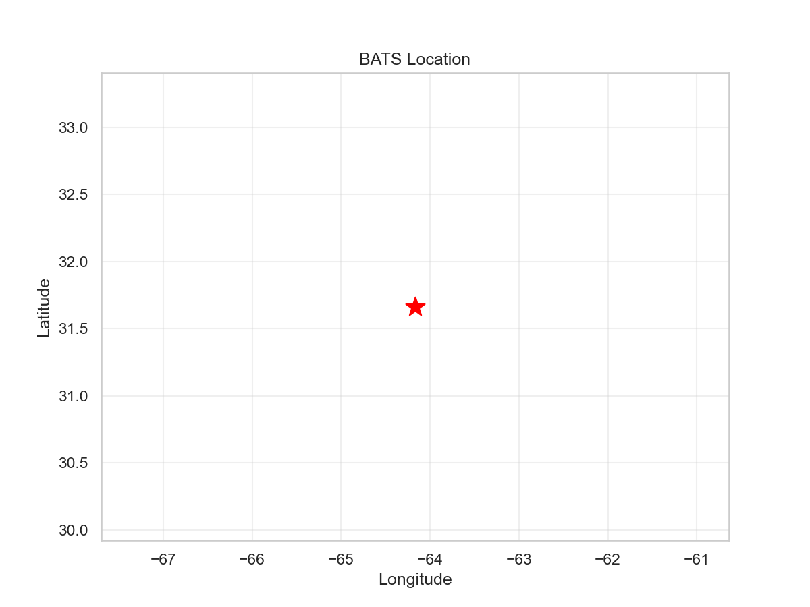
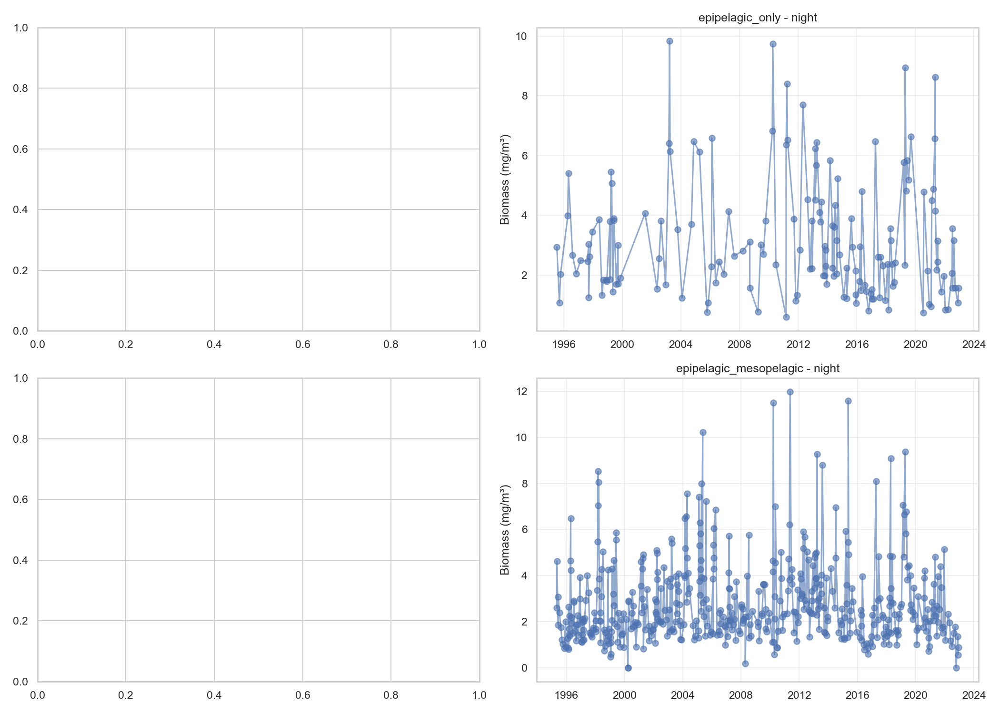

# BATS Station Report

**Date**: 2026-01-28 16:34:51
**Location**: 31.6°N, -64.2°W

## Summary

- Initial rows: 6,728
- Final rows: 663
- Period: 1995-05-10 to 2022-12-13

### Exclusions

- Depth <50m: 5 rows
- Sieve 5000µm: 1341 rows
- Missing sieve: 22 rows

## Figures

