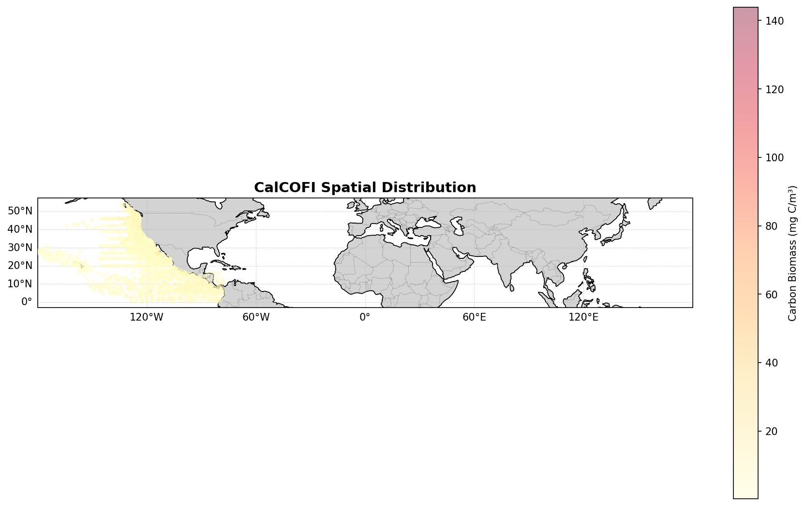
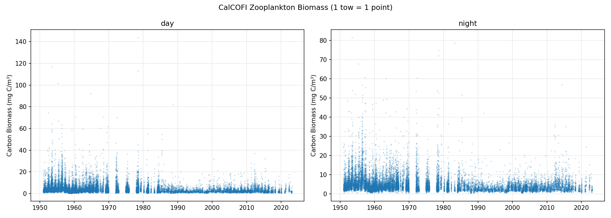

# CalCOFI Station Report

**Date**: 2026-03-04 13:40:41
**Region**: California Current System (0.0-54.3°N, -179.8--77.7°E)

## Summary

- Initial rows: 45,310
- Final tows (rows): 45,310
- Period: 1951-01-09 to 2023-01-25

### Exclusions

- small_plankton NaN: 0 rows
- small_plankton ≤ 0: 0 rows

### Depth Protocol

- 140m protocol (≤1968): 23594 tows
- 210m protocol (>1968): 21716 tows

### Biomass Statistics

| Metric | Mean | Median | Min | Max |
|--------|------|--------|-----|-----|
| Carbon Biomass (mg C/m³) | 4.80 | 3.45 | 0.19 | 143.94 |

## Figures

## Methodology

**Conversion Method**: Lavaniegos & Ohman (2007)

**Formula**: `log10(C) = 0.6664 × log10(DV) + 1.9997`

where C = Carbon biomass (mg C/m²), DV = Displacement Volume (ml/m²)

**Source Variable**: small_plankton (organisms with individual DV <5ml)

**Aggregation**: None (1 row = 1 tow, Parquet)

## Points d'attention et biais potentiels

### 1. Changement de protocole de profondeur (1969)

- **Avant 1969** : Profondeur standard 140m
- **Après 1968** : Profondeur standard 210m
- **Impact** : Différence de volume échantillonné et de couverture verticale. Les traits post-1968 intègrent une partie de la zone mésopélagique (150-210m).
- **Mitigation** : Conversion en concentration volumique (mg/m³) normalise partiellement l'effet.

### 2. Conversion non-linéaire Lavaniegos & Ohman (2007)

- **Formule empirique** : Basée sur des échantillons CalCOFI (1951-2005)
- **Relation log-log** : Amplification des incertitudes pour les faibles et fortes valeurs
- **Limites de validité** : Formule calibrée sur le système California Current

### 3. Restriction aux petits organismes (small_plankton)

- **Seuil** : Organismes avec volume individuel <5ml
- **Exclus** : Grands organismes gélatineux, euphausiacés adultes
- **Justification** : Cohérence avec HOT/BATS (fraction <5mm)

### 4. Classification jour/nuit

- **Méthode** : Calcul astronomique (lever/coucher soleil) via bibliothèque `astral`
- **Avantage** : Précision basée sur position géographique et date réelles
- **Distribution observée** : 22572 jour (49.8%) vs 22738 nuit (50.2%)

### 5. Couverture temporelle et spatiale

- **Période** : 1951-2023 (72 ans)
- **Échantillonnage** : Irrégulier dans le temps et l'espace
- **Biais géographique** : Concentration des observations près des côtes californiennes

