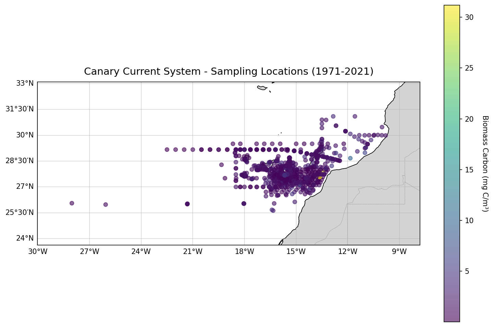
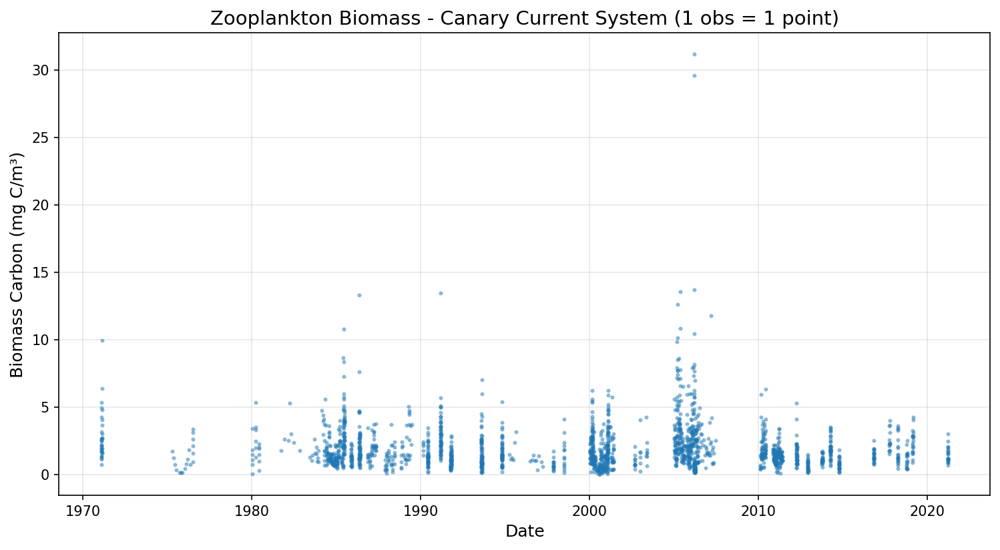

# Canary Current System Report

**Date**: 2026-03-04 13:40:33
**Location**: Canary Islands region (28°N, -16°W)

## Summary

- Initial rows: 1,970
- Final observations (rows): 1,970
- Period: 1971-01-31 to 2021-03-31

### Exclusions

- No exclusions applied (all size fractions ≤250µm)

## Figures

## Methodology

**Sampling Method**: Oblique tows from surface to 200m depth

**Nets**: WP-2 (92%), LHPR (6%), Juday Bogorov (1%)

**Size Fractions**: >200µm (98.4%), >250µm (1.3%)

**Unit Conversion**: mg C/m² → mg C/m³ (division by 200m depth)

**Aggregation**: None (1 row = 1 observation)

**Output format**: 1 row = 1 observation (Parquet)

## Biomass Statistics

| Metric | Mean | Median | Min | Max |
|--------|------|--------|-----|-----|
| Carbon Biomass (mg C/m³) | 1.94 | 1.50 | 0.01 | 31.19 |

## Points d'attention et biais potentiels

### 1. Multi-sources (compilation 50 ans)

- **Type** : Compilation de ~30 publications scientifiques (1971-2021)
- **Avantage** : Couverture temporelle exceptionnelle, série temporelle longue
- **Limitation** : Hétérogénéité méthodologique entre études, protocoles variables
- **Impact** : Variable `reference` permet traçabilité, mais comparabilité inter-études limitée

### 2. Hétérogénéité des filets

- **WP-2** : 1821 obs (92%)
- **LHPR** : 123 obs (6%)
- **Juday Bogorov** : 26 obs (1%)
- **Impact** : Efficacité de capture variable selon le filet
- **Mitigation** : WP-2 dominant garantit cohérence majoritaire

### 3. Conversion mg C/m² → mg C/m³

- **Formule** : biomass_carbon = biomass_carbon_m² / 200
- **Hypothèse** : Distribution verticale uniforme du zooplancton sur 0-200m
- **Réalité** : Distribution hétérogène (thermocline, DCM, migrations verticales)
- **Cohérence** : Conversion nécessaire pour compatibilité avec HOT/BATS/PAPA/CalCOFI (mg C/m³)

### 4. Profondeur fixe (0-200m)

- **Profondeur** : Tous les traits à 0-200m (métadonnées PANGAEA)
- **Limitation** : Pas d'information sur variabilité réelle des profondeurs de trait
- **Différence HOT/BATS** : HOT/BATS ont profondeurs variables (50-268m), Canaries homogène

### 5. Fractions de taille

- **>200µm** : 1944 obs (98.4%)
- **>250µm** : 26 obs (1.3%)
- **Cohérence** : Pas de fraction >5mm détectée, cohérent avec autres stations

### 6. Classification jour/nuit

- **Méthode** : Colonne `period` des données source (jour/nuit)
- **Distribution observée** : 1601 jour (81.3%) vs 364 nuit (18.5%)

### 7. Couverture temporelle et spatiale

- **Période** : 1971-2021 (50 ans)
- **Échantillonnage** : Irrégulier, opportuniste selon publications
- **Biais temporel** : Concentration possible sur certaines périodes
- **Biais spatial** : Concentration autour des Canaries, couverture NW Afrique plus sparse

