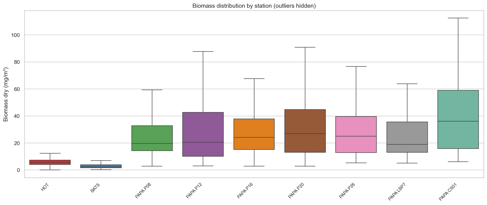
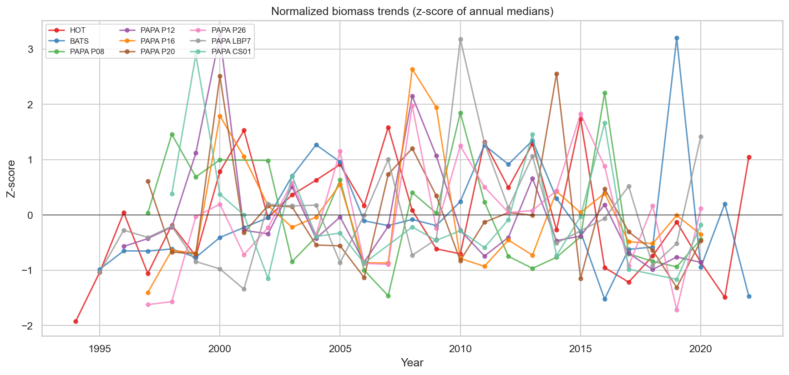
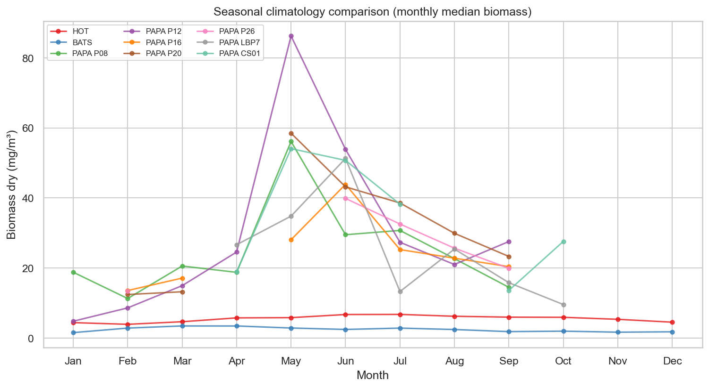
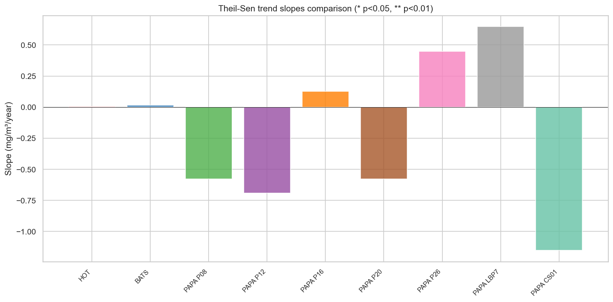

# Inter-Station Comparison Report

**Stations analyzed**: 9  

---

## 1. Station Summary

| Station | N obs | Period | Median biomass (mg/m³) | Mean biomass (mg/m³) |
|---------|-------|--------|----------------------|---------------------|
| HOT | 1176 | 1994–2022 | 5.57 | 5.99 |
| BATS | 810 | 1995–2022 | 2.36 | 2.92 |
| PAPA P08 | 63 | 1997–2020 | 19.61 | 25.52 |
| PAPA P12 | 70 | 1996–2020 | 20.56 | 33.03 |
| PAPA P16 | 59 | 1997–2020 | 24.14 | 32.21 |
| PAPA P20 | 64 | 1997–2020 | 26.98 | 37.01 |
| PAPA P26 | 74 | 1997–2020 | 25.08 | 28.45 |
| PAPA LBP7 | 43 | 1995–2020 | 19.02 | 27.30 |
| PAPA CS01 | 37 | 1998–2020 | 36.11 | 45.13 |

## 2. Normalized Time Series

Annual median biomass normalized to z-scores for cross-station comparison.

## 3. Seasonal Climatology Comparison

## 4. Trend Comparison

| Station | Theil-Sen slope | Mann-Kendall τ | p-value | N years |
|---------|----------------|---------------|---------|---------|
| HOT | +0.0048 | 0.025 | 0.8672  | 29 |
| BATS | +0.0156 | 0.135 | 0.3136  | 28 |
| PAPA P08 | -0.5773 | -0.257 | 0.0911  | 23 |
| PAPA P12 | -0.6908 | -0.273 | 0.0579  | 25 |
| PAPA P16 | +0.1255 | 0.014 | 0.9413  | 24 |
| PAPA P20 | -0.5786 | -0.138 | 0.3627  | 24 |
| PAPA P26 | +0.4490 | 0.167 | 0.2675  | 24 |
| PAPA LBP7 | +0.6475 | 0.247 | 0.0883  | 25 |
| PAPA CS01 | -1.1527 | -0.210 | 0.1967  | 21 |

---

*Report generated by `src/core/compare_stations.py`*