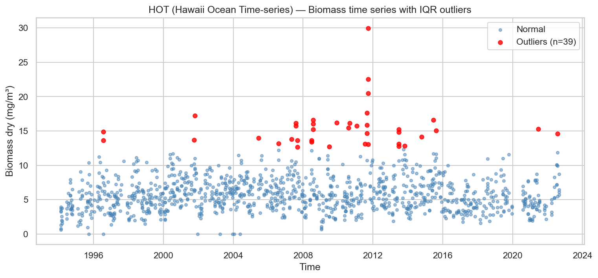
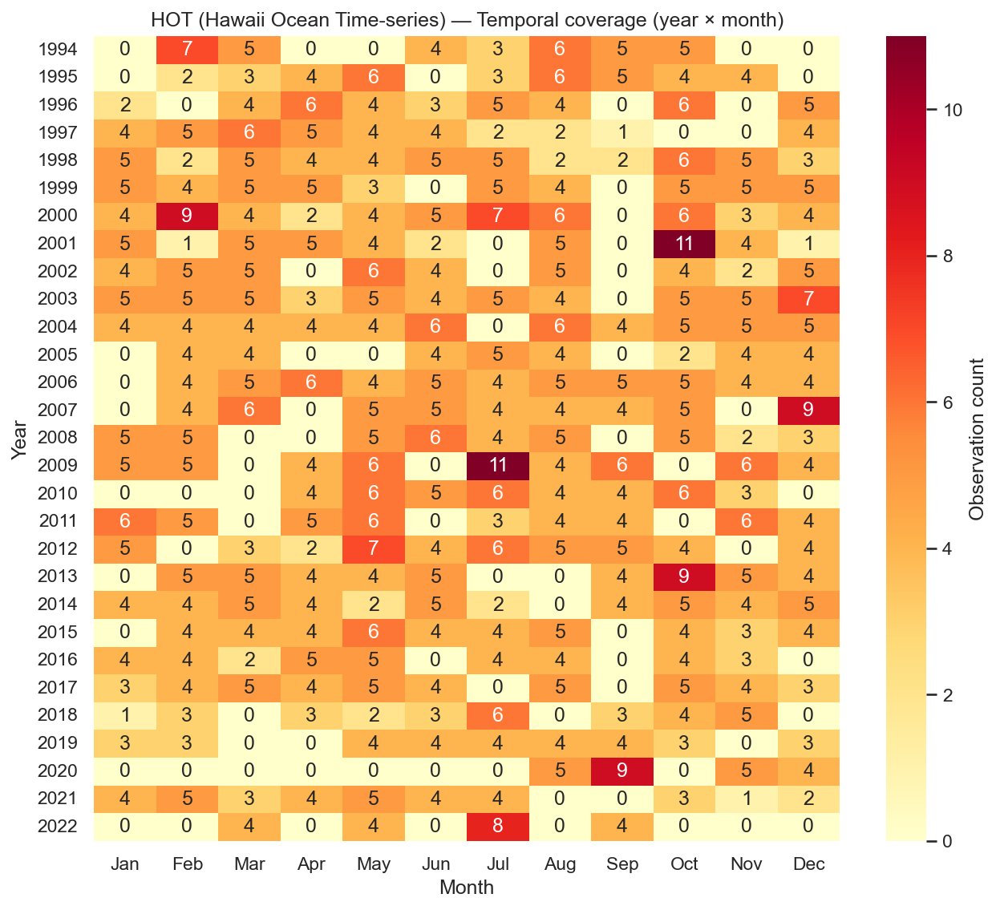
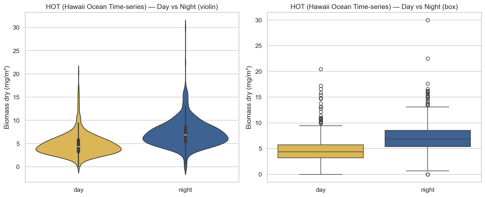
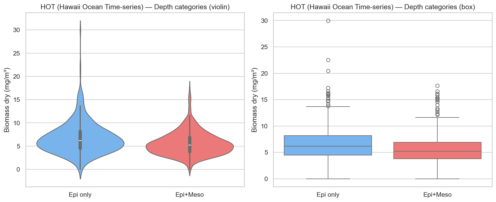
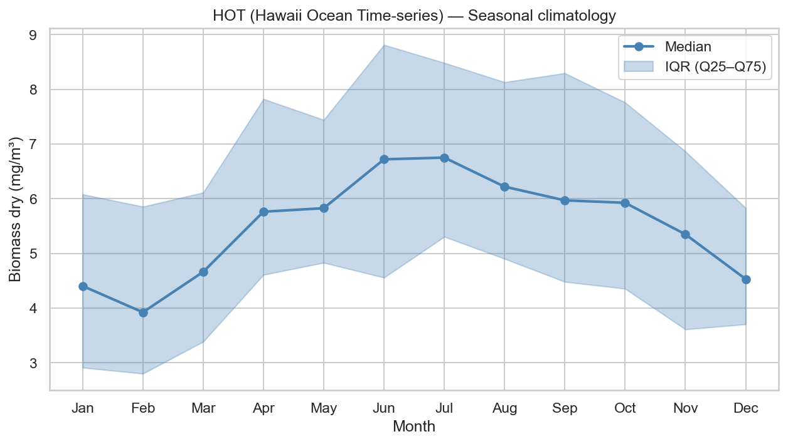
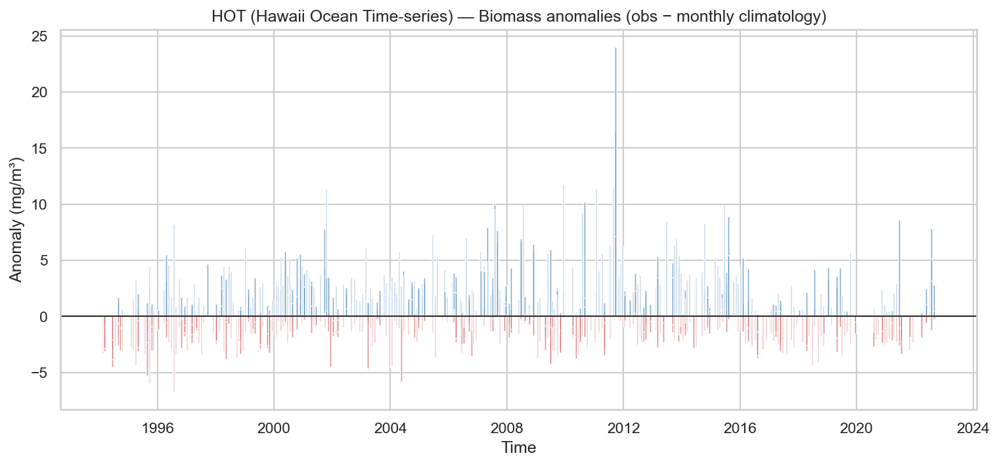
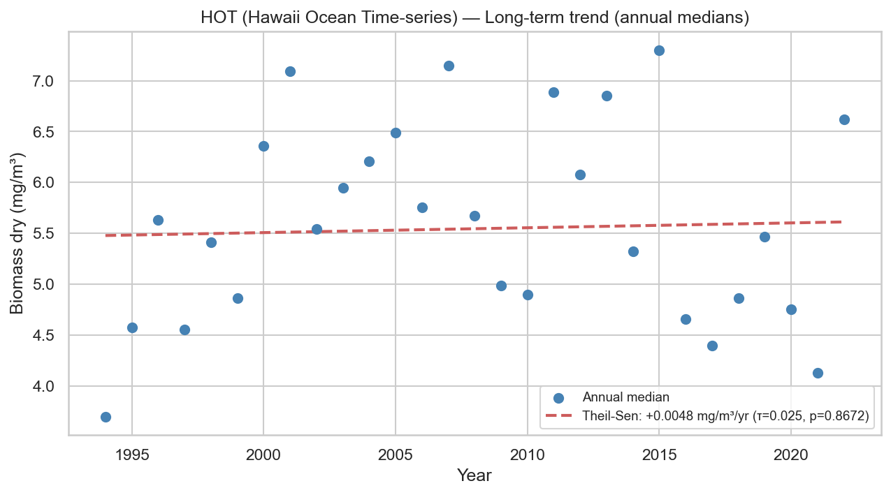

# Statistical Analysis — HOT (Hawaii Ocean Time-series)

**Station**: hot  
**Source**: `hot_zooplankton_obs.nc`  
**Observations**: 1176 (after dropping NaN biomass)  
**Period**: 1994-02-17 to 2022-09-02  

---

## 1. Outlier Detection (IQR × 1.5)

- Total observations: 1176
- Outliers detected: 39
- Outlier fraction: 3.3%
- Biomass Q1: 4.0152 mg/m³
- Biomass Q3: 7.4166 mg/m³

## 2. Temporal Coverage

- Year range: 1994–2022
- Months with 0 observations (gaps): 81
- Median monthly observation count: 4.0

## 3. Day/Night Bias

| Metric | Day | Night |
|--------|-----|-------|
| N | 595 | 581 |
| Median (mg/m³) | 4.3598 | 6.8435 |
| Mean (mg/m³) | 4.7888 | 7.2201 |

- Night/Day median ratio: 1.57
- Mann-Whitney U p-value: 1.31e-64 (**)

## 4. Depth Category Bias

| Metric | Epipelagic only | Epi + Mesopelagic |
|--------|----------------|-------------------|
| N | 427 | 749 |
| Median (mg/m³) | 6.1689 | 5.2408 |
| Mean (mg/m³) | 6.7089 | 5.5802 |

- Meso/Epi median ratio: 0.85
- Mann-Whitney U p-value: 1.79e-09 (**)

## 5. Seasonal Climatology

Monthly median biomass (mg/m³):

| Month | Median | Q25 | Q75 | N |
|-------|--------|-----|-----|---|
| Jan | 4.4061 | 2.9138 | 6.0829 | 78 |
| Feb | 3.9250 | 2.8036 | 5.8566 | 103 |
| Mar | 4.6647 | 3.3880 | 6.1148 | 97 |
| Apr | 5.7644 | 4.6103 | 7.8251 | 87 |
| May | 5.8285 | 4.8319 | 7.4435 | 120 |
| Jun | 6.7224 | 4.5593 | 8.8152 | 95 |
| Jul | 6.7536 | 5.3069 | 8.4859 | 110 |
| Aug | 6.2222 | 4.9039 | 8.1331 | 108 |
| Sep | 5.9717 | 4.4822 | 8.2972 | 73 |
| Oct | 5.9273 | 4.3567 | 7.7617 | 121 |
| Nov | 5.3508 | 3.6133 | 6.8669 | 88 |
| Dec | 4.5327 | 3.7060 | 5.8321 | 96 |

## 6. Long-term Trend

- Number of years: 29
- Theil-Sen slope: +0.0048 mg/m³/year
- Mann-Kendall τ: 0.025
- Mann-Kendall p-value: 0.8672

## Extra — Biomass Carbon

- Observations: 988
- Median: 1.8484 mg/m³
- Mean: 2.0625 mg/m³
- Theil-Sen slope: -0.0018 mg/m³/year
- Mann-Kendall p-value: 0.6944

## Extra — Biomass Nitrogen

- Observations: 988
- Median: 0.4458 mg/m³
- Mean: 0.4942 mg/m³
- Theil-Sen slope: -0.0011 mg/m³/year
- Mann-Kendall p-value: 0.7270

---

*Report generated by `src/core/analyze_station.py`*