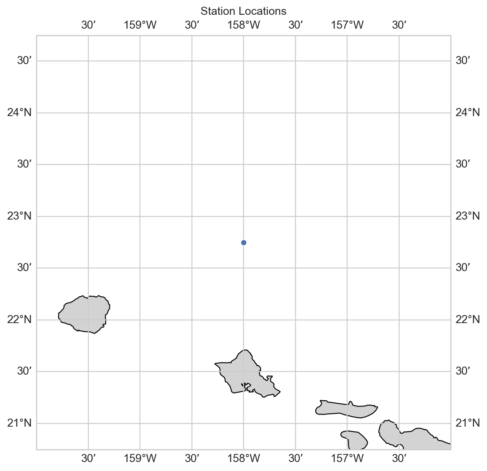
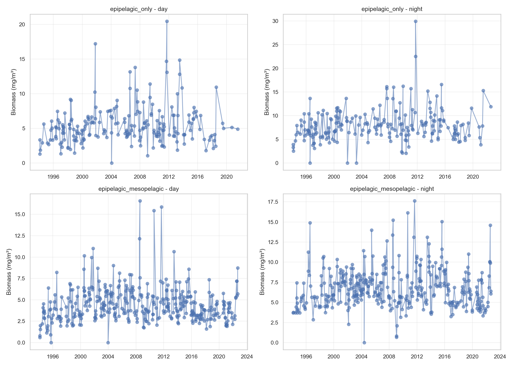

# HOT Station Processing Report

**Date**: 2026-02-19 12:17:36
**Station**: Hawaii Ocean Time-series (HOT), Station ALOHA
**Location**: 22.75°N, -158°W

---

## Data Processing Summary

- **Input file**: `hot_zooplankton.csv`
- **Output file**: `hot_zooplankton_obs.nc`
- **Initial rows**: 9,348
- **Initial tows**: 1,558
- **Final rows**: 1,176
- **Time period**: 1994-02-17 to 2022-09-02

### Exclusions Applied

1. **Shallow tows** (depth <50m): 2 tows excluded
   - Tow 48: 1995-02-05T11:20:00 | depth=17m
   - Tow 386: 2000-03-28T11:02:00 | depth=9m

2. **Fraction 5** (>5mm micronekton): 1,556 rows excluded

### Depth Categories

- **epipelagic_only** (≤150m): 427 observations
  - Samples ONLY epipelagic zone (0-150m)
  - Mean tow depth: 126.2m

- **epipelagic_mesopelagic** (>150m): 749 observations
  - Samples BOTH epipelagic (0-150m) AND mesopelagic (>150m) zones
  - Mean tow depth: 186.9m

### Biomass Statistics

| Metric | Mean | Median | Min | Max |
|--------|------|--------|-----|-----|
| Dry Weight (mg/m³) | 5.99 | 5.57 | 0.00 | 29.98 |
| Carbon (mg/m³) | 2.06 | 1.85 | 0.23 | 11.21 |
| Nitrogen (mg/m³) | 0.49 | 0.45 | 0.05 | 2.66 |

---

## Figures

### Station Location

### Time Series of Biomass

---

## Methodology

**Sampling Method**: Oblique tows from surface to maximum depth and back

**Net**: 1 m² with 202 µm mesh (Nitex)

**Size Fractions**: 0 (200µm), 1 (500µm), 2 (1mm), 3 (2mm), 4 (5mm)

**Unit Conversion**: Area density (g/m² or mg/m²) divided by tow depth → concentration (mg/m³)

**Aggregation**:
1. Sum of size fractions 0-4 per tow
2. Median of tows per day/depth_category/day_night

---

## Points d'attention et biais potentiels

### 1. Station fixe unique

- **Type** : Station ALOHA (~22.75°N, -158°W)
- **Avantage** : Séries temporelles sans confondant spatial, répétabilité élevée
- **Limitation** : Représentativité régionale limitée, pas de gradient spatial
- **Impact** : Excellente pour tendances temporelles, non généralisable à l'ensemble du gyre subtropical Nord-Pacifique

### 2. Fractionnement par taille

- **Méthode** : 5 fractions (0: 0.2-0.5mm, 1: 0.5-1mm, 2: 1-2mm, 3: 2-5mm, 4: >5mm)
- **Somme** : Fractions 0-4 (0.2-5mm et >5mm)
- **Avantage** : Information sur structure de taille du zooplancton
- **Limitation** : Somme totale mélange différentes efficacités de capture par fraction

### 3. Exclusion de la fraction 5 (>5mm)

- **Fraction exclue** : Fraction 5 (>5mm) - 0 observations
- **Justification** : Capture du micronecton (organismes >20mm) mal échantillonné par filet 1m²/202µm, efficacité de capture très faible pour grands organismes mobiles
- **Organismes concernés** : Grands euphausiacés, méduses, larves de poissons, céphalopodes
- **Impact** : Sous-estimation de la biomasse totale, mais meilleure cohérence avec définition standard du zooplancton (<5mm)

### 4. Exclusion des traits aberrants (<50m)

- **Exclus** : 12 traits avec profondeur <50m
- **Justification** : Écart majeur avec protocole standard (~175m), potentiels problèmes techniques ou conditions météo défavorables
- **Impact** : Perte d'information sur périodes à conditions difficiles

### 5. Variabilité des profondeurs de trait

- **Profondeur médiane** : 167m
- **Variabilité** : 55-268m (écart-type 36m)
- **Protocoles** : Deux standards observés (~150m et ~200m)
- **Impact** : Traits peu profonds échantillonnent uniquement l'épipélagique, traits profonds incluent une partie du mésopélagique
- **Mitigation** : Catégorisation ≤150m vs >150m

### 6. Conversion densité surfacique → concentration volumique

- **Formule** : concentration (mg/m³) = densité (mg/m²) / profondeur (m)
- **Hypothèse** : Distribution uniforme du zooplancton sur la colonne d'eau échantillonnée
- **Réalité** : Distribution verticale hétérogène (thermocline, DCM, migrations)
- **Impact** : Conversion valide pour comparaisons entre traits de même profondeur, biais potentiel lors de comparaisons entre profondeurs différentes

### 7. Disponibilité carbone et azote

- **Avantage unique** : Mesures directes de carbone (C) et azote (N) disponibles
- **Variables** : biomass_dry, biomass_carbon, biomass_nitrogen
- **Utilité** : Permet d'estimer les ratios C:N, conversion vers d'autres unités
- **Limitation** : Non disponible pour BATS/PAPA/CalCOFI, comparaisons limitées à la biomasse sèche

### 8. Classification jour/nuit

- **Méthode** : Heure locale simple (06h-18h = jour, 18h-06h = nuit)
- **Simplicité** : Facile à reproduire, pas de dépendance externe
- **Limitation** : Ne tient pas compte de la variation saisonnière du lever/coucher du soleil
- **Distribution observée** : 50.1% jour vs 49.9% nuit

### 9. Couverture temporelle

- **Période** : 1994-2022 (29 ans)
- **Fréquence** : Mensuelle environ (varie selon périodes)
- **Gaps** : À vérifier (événements El Niño, problèmes logistiques)

---

*Generated with seapopym-data pipeline*
