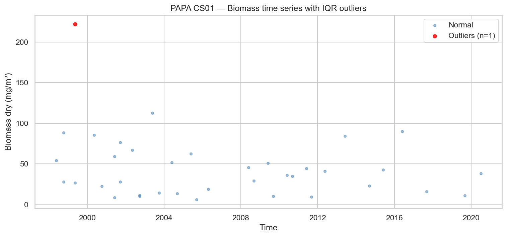
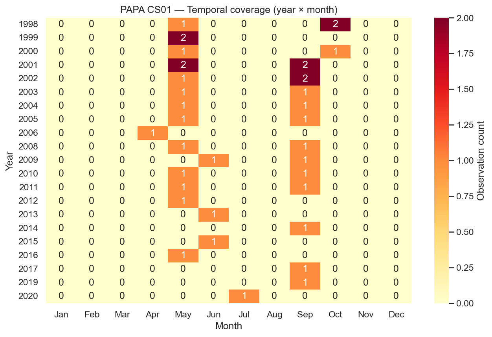
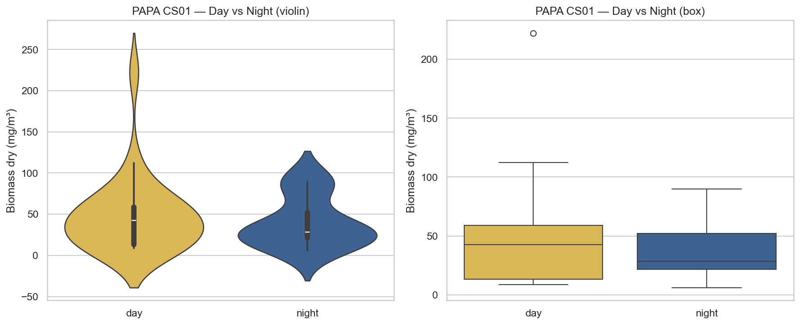
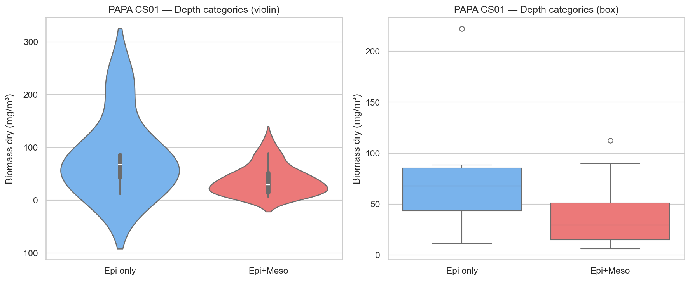
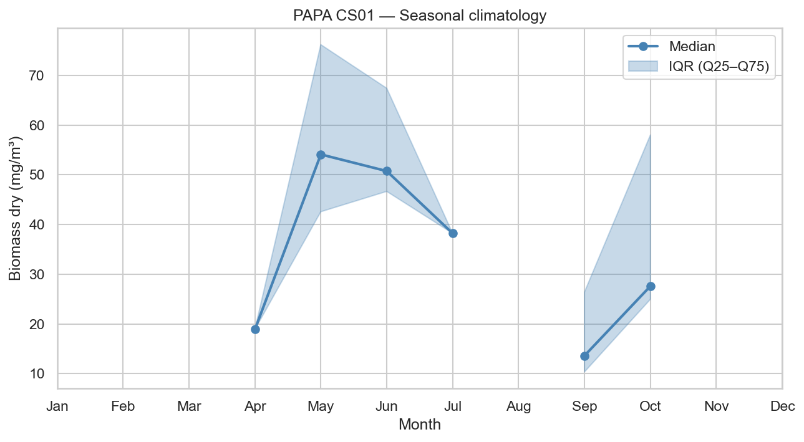
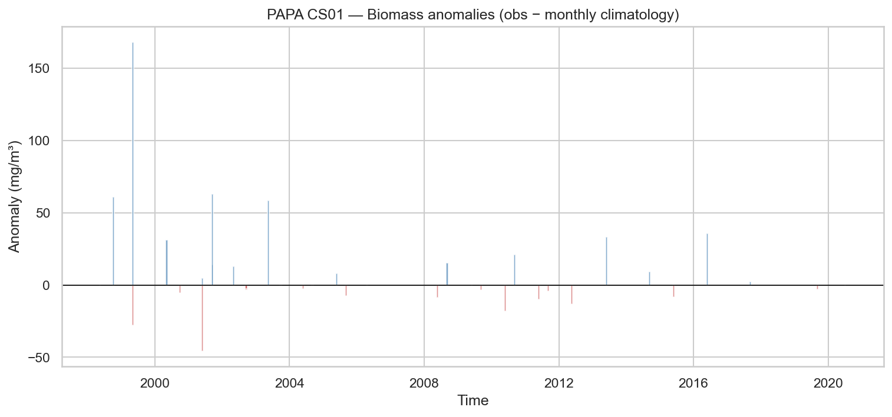
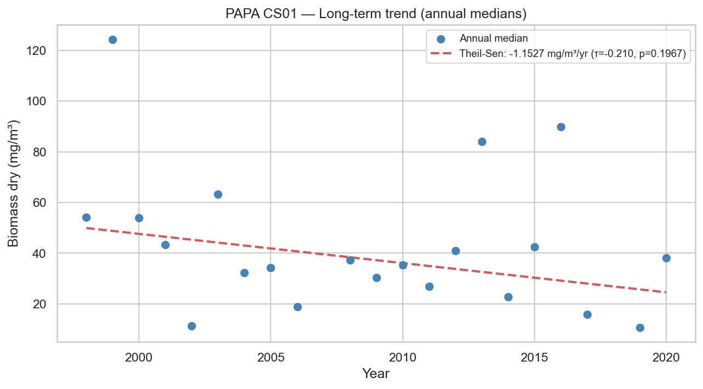

# Statistical Analysis — PAPA CS01

**Station**: papa_CS01  
**Source**: `papa_CS01_obs.nc`  
**Observations**: 37 (after dropping NaN biomass)  
**Period**: 1998-05-17 to 2020-07-05  

---

## 1. Outlier Detection (IQR × 1.5)

- Total observations: 37
- Outliers detected: 1
- Outlier fraction: 2.7%
- Biomass Q1: 15.8543 mg/m³
- Biomass Q3: 58.9880 mg/m³

## 2. Temporal Coverage

- Year range: 1998–2020
- Months with 0 observations (gaps): 244
- Median monthly observation count: 1.0

## 3. Day/Night Bias

| Metric | Day | Night |
|--------|-----|-------|
| N | 25 | 12 |
| Median (mg/m³) | 42.5690 | 28.3556 |
| Mean (mg/m³) | 47.5902 | 39.9960 |

- Night/Day median ratio: 0.67
- Mann-Whitney U p-value: 0.7827

## 4. Depth Category Bias

| Metric | Epipelagic only | Epi + Mesopelagic |
|--------|----------------|-------------------|
| N | 6 | 31 |
| Median (mg/m³) | 67.7666 | 29.1109 |
| Mean (mg/m³) | 82.6137 | 37.8718 |

- Meso/Epi median ratio: 0.43
- Mann-Whitney U p-value: 0.0798

## 5. Seasonal Climatology

Monthly median biomass (mg/m³):

| Month | Median | Q25 | Q75 | N |
|-------|--------|-----|-----|---|
| Jan | N/A | N/A | N/A | 0 |
| Feb | N/A | N/A | N/A | 0 |
| Mar | N/A | N/A | N/A | 0 |
| Apr | 18.8842 | 18.8842 | 18.8842 | 1 |
| May | 54.0886 | 42.5646 | 76.1649 | 15 |
| Jun | 50.7354 | 46.6522 | 67.3982 | 3 |
| Jul | 38.2156 | 38.2156 | 38.2156 | 1 |
| Aug | N/A | N/A | N/A | 0 |
| Sep | 13.6131 | 10.3418 | 26.4064 | 14 |
| Oct | 27.6004 | 24.9515 | 57.9991 | 3 |
| Nov | N/A | N/A | N/A | 0 |
| Dec | N/A | N/A | N/A | 0 |

## 6. Long-term Trend

- Number of years: 21
- Theil-Sen slope: -1.1527 mg/m³/year
- Mann-Kendall τ: -0.210
- Mann-Kendall p-value: 0.1967

---

*Report generated by `src/core/analyze_station.py`*