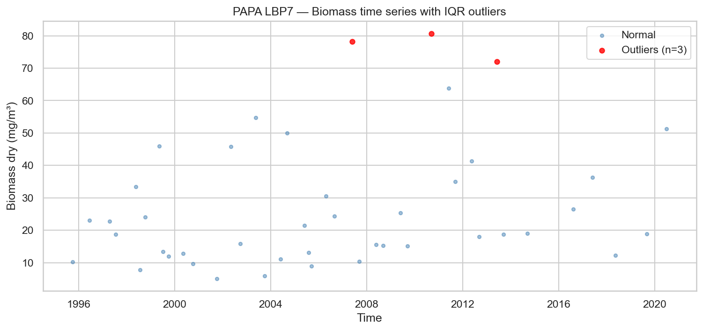
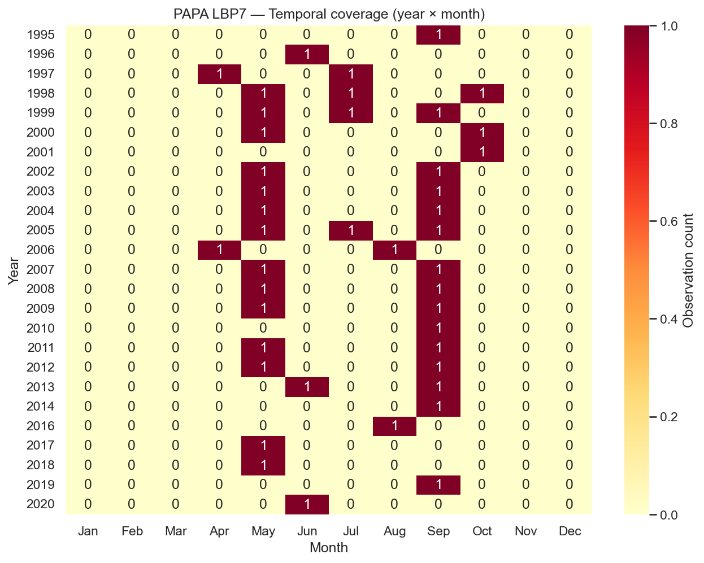
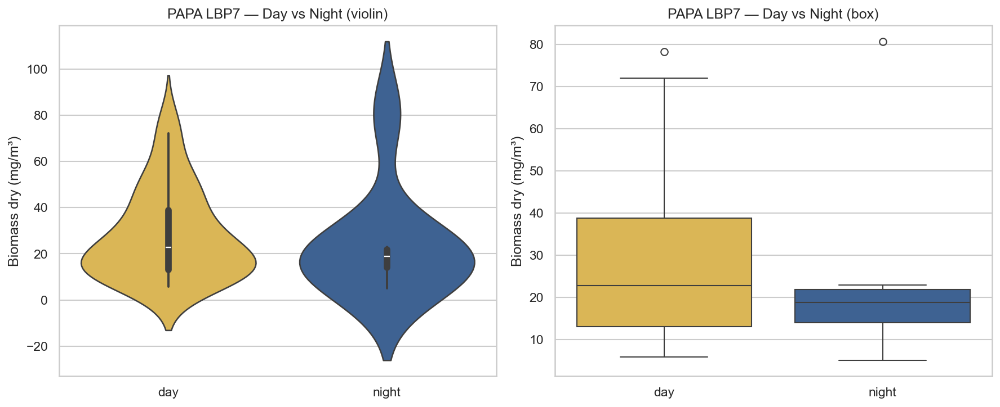
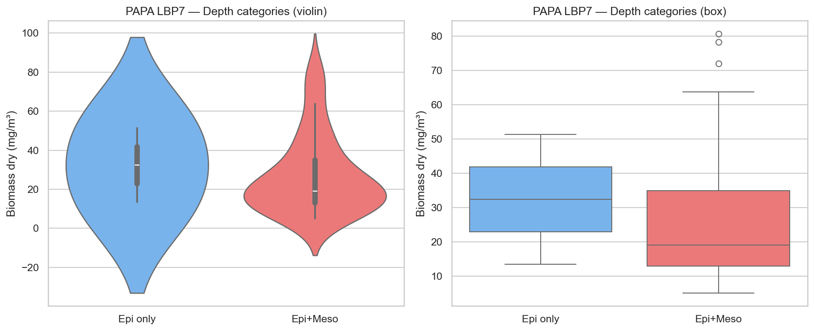
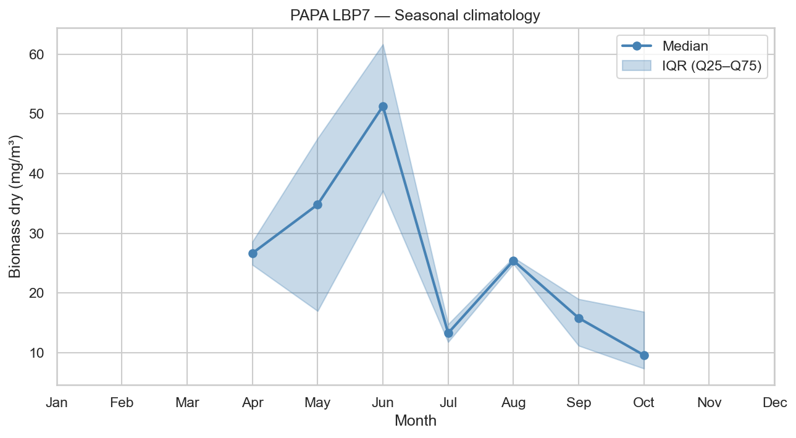
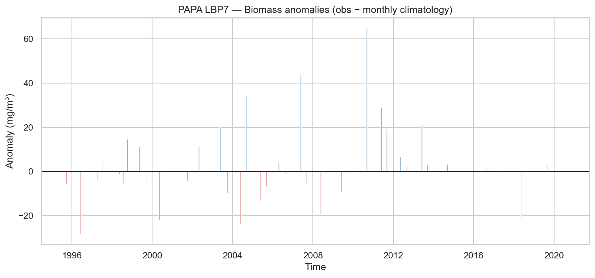
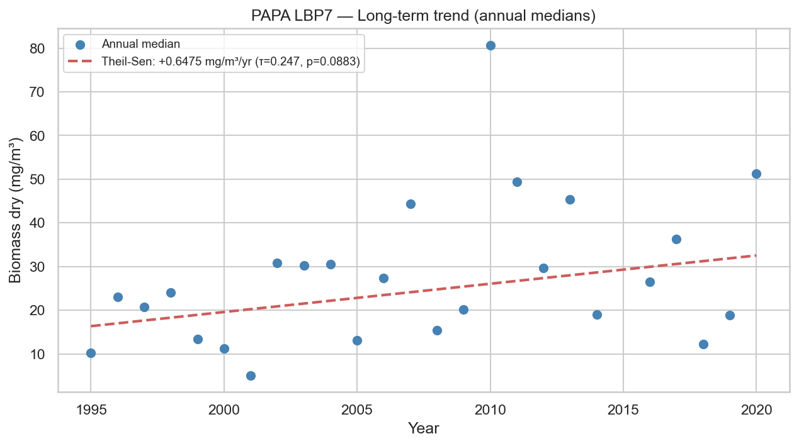

# Statistical Analysis — PAPA LBP7

**Station**: papa_LBP7  
**Source**: `papa_LBP7_obs.nc`  
**Observations**: 43 (after dropping NaN biomass)  
**Period**: 1995-09-28 to 2020-06-30  

---

## 1. Outlier Detection (IQR × 1.5)

- Total observations: 43
- Outliers detected: 3
- Outlier fraction: 7.0%
- Biomass Q1: 12.9949 mg/m³
- Biomass Q3: 35.6279 mg/m³

## 2. Temporal Coverage

- Year range: 1995–2020
- Months with 0 observations (gaps): 269
- Median monthly observation count: 1.0

## 3. Day/Night Bias

| Metric | Day | Night |
|--------|-----|-------|
| N | 35 | 8 |
| Median (mg/m³) | 22.7845 | 18.8395 |
| Mean (mg/m³) | 28.0175 | 24.1643 |

- Night/Day median ratio: 0.83
- Mann-Whitney U p-value: 0.5095

## 4. Depth Category Bias

| Metric | Epipelagic only | Epi + Mesopelagic |
|--------|----------------|-------------------|
| N | 2 | 41 |
| Median (mg/m³) | 32.3662 | 19.0223 |
| Mean (mg/m³) | 32.3662 | 27.0535 |

- Meso/Epi median ratio: 0.59
- Mann-Whitney U p-value: N/A (test skipped, n < 5)

## 5. Seasonal Climatology

Monthly median biomass (mg/m³):

| Month | Median | Q25 | Q75 | N |
|-------|--------|-----|-----|---|
| Jan | N/A | N/A | N/A | 0 |
| Feb | N/A | N/A | N/A | 0 |
| Mar | N/A | N/A | N/A | 0 |
| Apr | 26.6520 | 24.7182 | 28.5857 | 2 |
| May | 34.8146 | 16.9761 | 45.8958 | 14 |
| Jun | 51.2889 | 37.1301 | 61.6636 | 3 |
| Jul | 13.2792 | 11.7819 | 14.7580 | 4 |
| Aug | 25.4117 | 24.8766 | 25.9468 | 2 |
| Sep | 15.8032 | 11.1679 | 18.9763 | 15 |
| Oct | 9.5777 | 7.3317 | 16.8465 | 3 |
| Nov | N/A | N/A | N/A | 0 |
| Dec | N/A | N/A | N/A | 0 |

## 6. Long-term Trend

- Number of years: 25
- Theil-Sen slope: +0.6475 mg/m³/year
- Mann-Kendall τ: 0.247
- Mann-Kendall p-value: 0.0883

---

*Report generated by `src/core/analyze_station.py`*