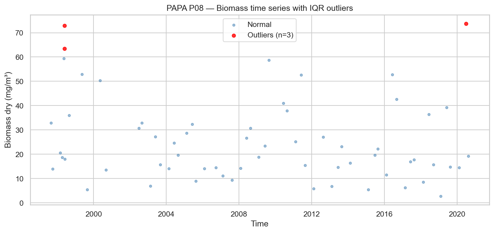
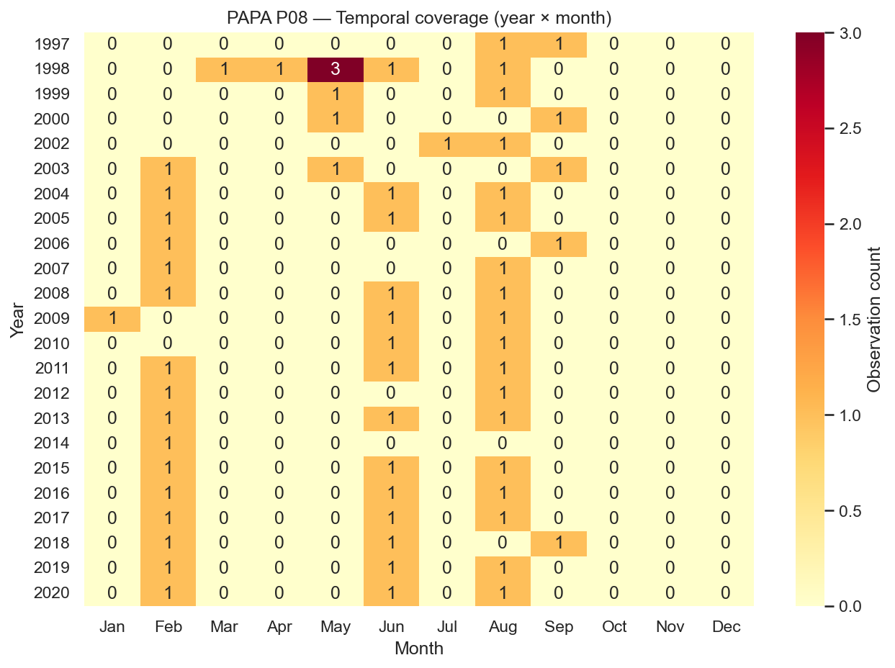
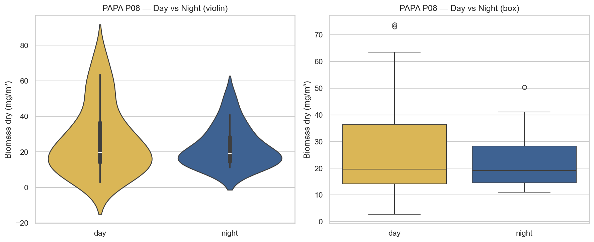
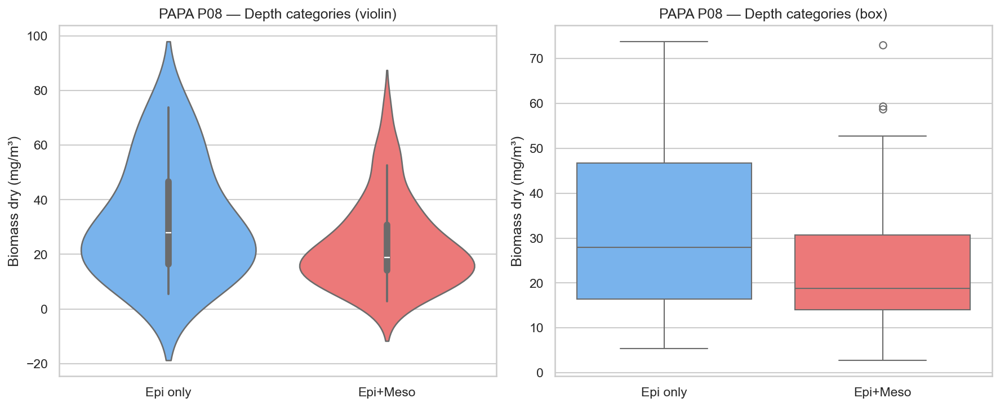
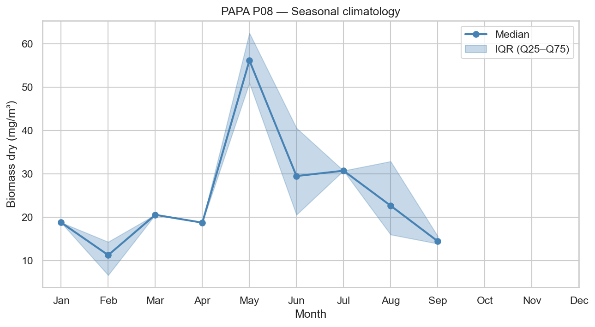
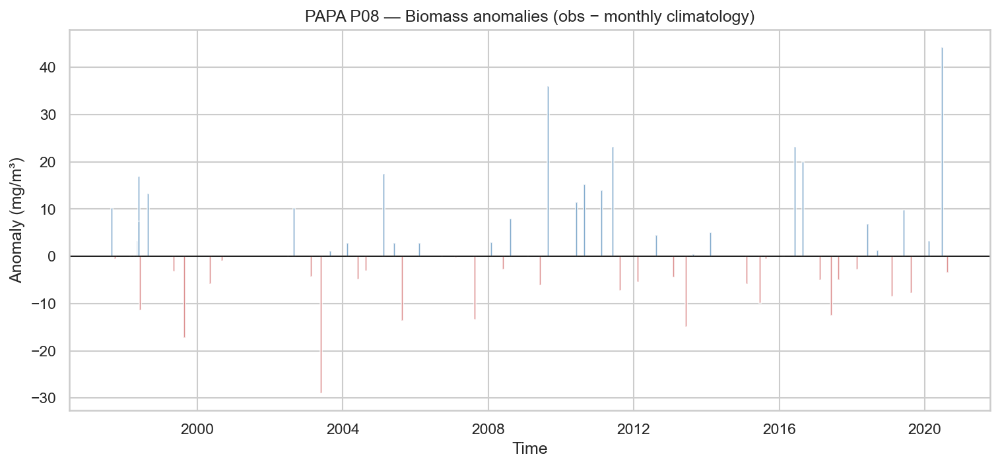
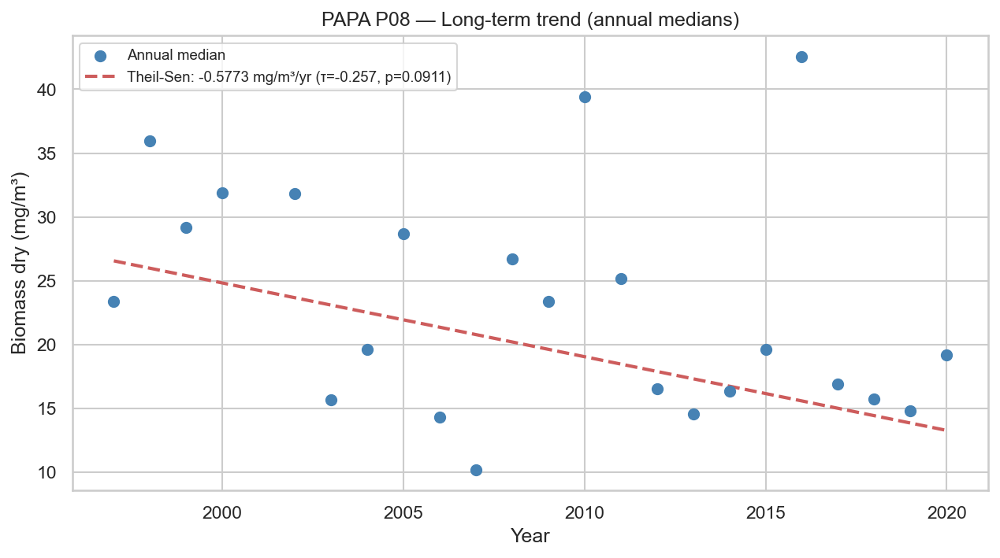

# Statistical Analysis — PAPA P08

**Station**: papa_P08  
**Source**: `papa_P08_obs.nc`  
**Observations**: 63 (after dropping NaN biomass)  
**Period**: 1997-08-29 to 2020-08-14  

---

## 1. Outlier Detection (IQR × 1.5)

- Total observations: 63
- Outliers detected: 3
- Outlier fraction: 4.8%
- Biomass Q1: 14.2177 mg/m³
- Biomass Q3: 32.8810 mg/m³

## 2. Temporal Coverage

- Year range: 1997–2020
- Months with 0 observations (gaps): 227
- Median monthly observation count: 1.0

## 3. Day/Night Bias

| Metric | Day | Night |
|--------|-----|-------|
| N | 45 | 18 |
| Median (mg/m³) | 19.6322 | 19.1859 |
| Mean (mg/m³) | 26.6429 | 22.7057 |

- Night/Day median ratio: 0.98
- Mann-Whitney U p-value: 0.7551

## 4. Depth Category Bias

| Metric | Epipelagic only | Epi + Mesopelagic |
|--------|----------------|-------------------|
| N | 14 | 49 |
| Median (mg/m³) | 27.9546 | 18.7959 |
| Mean (mg/m³) | 32.3864 | 23.5556 |

- Meso/Epi median ratio: 0.67
- Mann-Whitney U p-value: 0.1434

## 5. Seasonal Climatology

Monthly median biomass (mg/m³):

| Month | Median | Q25 | Q75 | N |
|-------|--------|-----|-----|---|
| Jan | 18.7959 | 18.7959 | 18.7959 | 1 |
| Feb | 11.2905 | 6.6641 | 14.3185 | 16 |
| Mar | 20.5719 | 20.5719 | 20.5719 | 1 |
| Apr | 18.7624 | 18.7624 | 18.7624 | 1 |
| May | 56.1373 | 50.9585 | 62.4600 | 6 |
| Jun | 29.5053 | 20.5774 | 40.5705 | 14 |
| Jul | 30.7336 | 30.7336 | 30.7336 | 1 |
| Aug | 22.6815 | 16.0152 | 32.8852 | 18 |
| Sep | 14.4878 | 13.9211 | 15.6684 | 5 |
| Oct | N/A | N/A | N/A | 0 |
| Nov | N/A | N/A | N/A | 0 |
| Dec | N/A | N/A | N/A | 0 |

## 6. Long-term Trend

- Number of years: 23
- Theil-Sen slope: -0.5773 mg/m³/year
- Mann-Kendall τ: -0.257
- Mann-Kendall p-value: 0.0911

---

*Report generated by `src/core/analyze_station.py`*