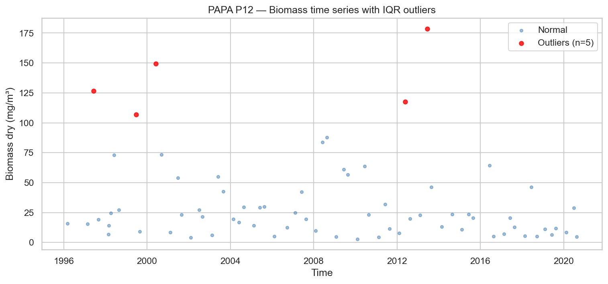
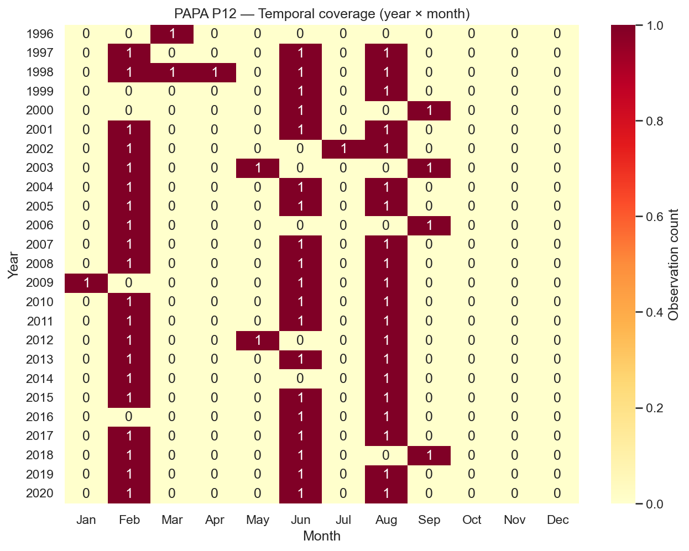
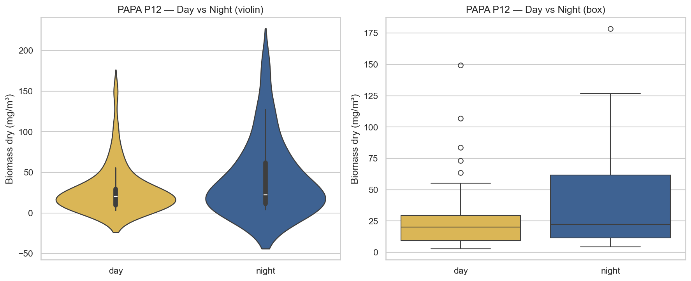
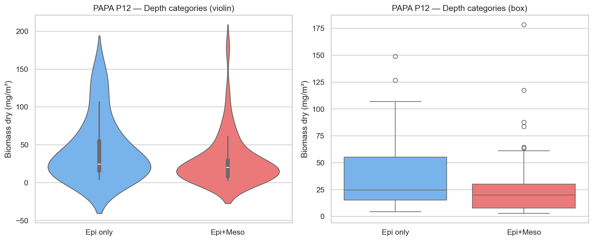
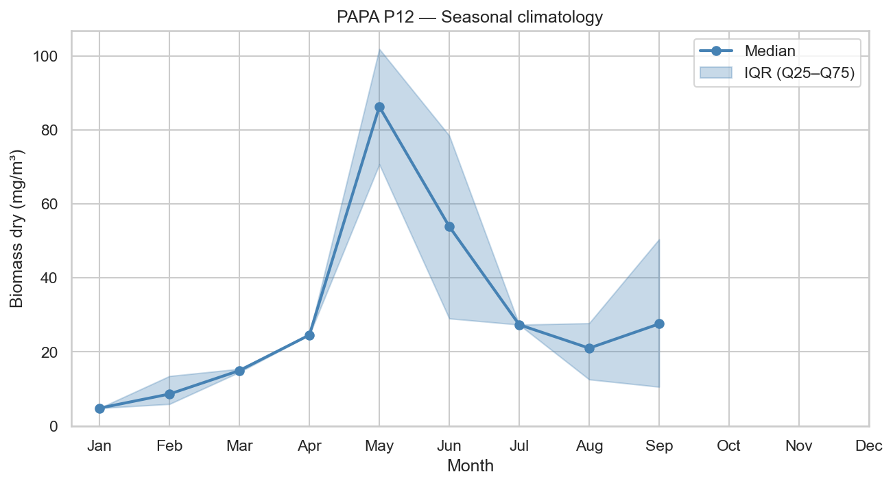
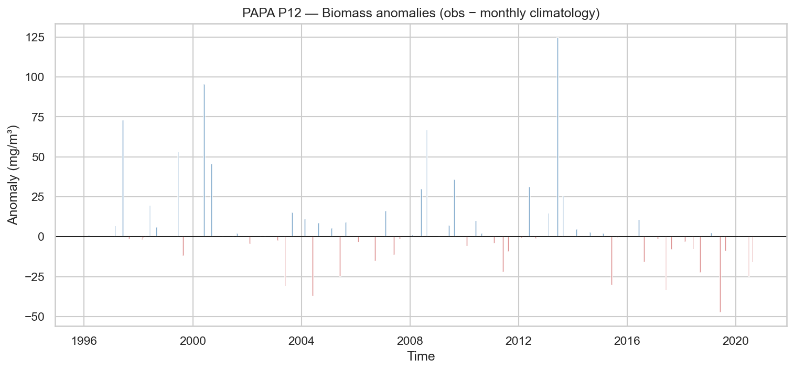
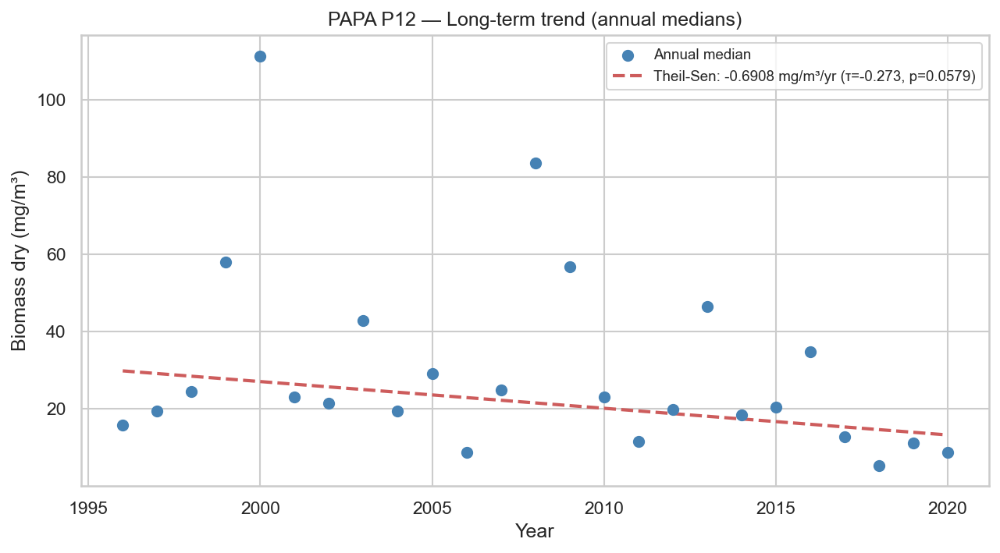

# Statistical Analysis — PAPA P12

**Station**: papa_P12  
**Source**: `papa_P12_obs.nc`  
**Observations**: 70 (after dropping NaN biomass)  
**Period**: 1996-03-06 to 2020-08-15  

---

## 1. Outlier Detection (IQR × 1.5)

- Total observations: 70
- Outliers detected: 5
- Outlier fraction: 7.1%
- Biomass Q1: 10.0266 mg/m³
- Biomass Q3: 42.6893 mg/m³

## 2. Temporal Coverage

- Year range: 1996–2020
- Months with 0 observations (gaps): 230
- Median monthly observation count: 1.0

## 3. Day/Night Bias

| Metric | Day | Night |
|--------|-----|-------|
| N | 46 | 24 |
| Median (mg/m³) | 20.1934 | 22.3087 |
| Mean (mg/m³) | 27.9363 | 42.8026 |

- Night/Day median ratio: 1.10
- Mann-Whitney U p-value: 0.2901

## 4. Depth Category Bias

| Metric | Epipelagic only | Epi + Mesopelagic |
|--------|----------------|-------------------|
| N | 21 | 49 |
| Median (mg/m³) | 24.5650 | 19.9059 |
| Mean (mg/m³) | 42.9683 | 28.7754 |

- Meso/Epi median ratio: 0.81
- Mann-Whitney U p-value: 0.1009

## 5. Seasonal Climatology

Monthly median biomass (mg/m³):

| Month | Median | Q25 | Q75 | N |
|-------|--------|-----|-----|---|
| Jan | 4.8057 | 4.8057 | 4.8057 | 1 |
| Feb | 8.6172 | 5.9142 | 13.4648 | 20 |
| Mar | 14.9594 | 14.5163 | 15.4026 | 2 |
| Apr | 24.5650 | 24.5650 | 24.5650 | 1 |
| May | 86.2570 | 70.6743 | 101.8396 | 2 |
| Jun | 53.8719 | 29.0285 | 78.4305 | 19 |
| Jul | 27.3459 | 27.3459 | 27.3459 | 1 |
| Aug | 21.0093 | 12.5567 | 27.7396 | 20 |
| Sep | 27.5707 | 10.5593 | 50.4326 | 4 |
| Oct | N/A | N/A | N/A | 0 |
| Nov | N/A | N/A | N/A | 0 |
| Dec | N/A | N/A | N/A | 0 |

## 6. Long-term Trend

- Number of years: 25
- Theil-Sen slope: -0.6908 mg/m³/year
- Mann-Kendall τ: -0.273
- Mann-Kendall p-value: 0.0579

---

*Report generated by `src/core/analyze_station.py`*