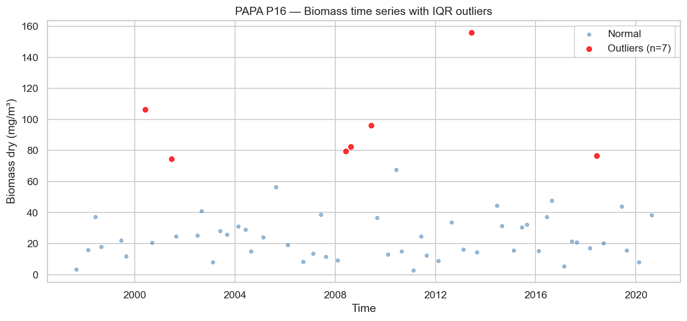
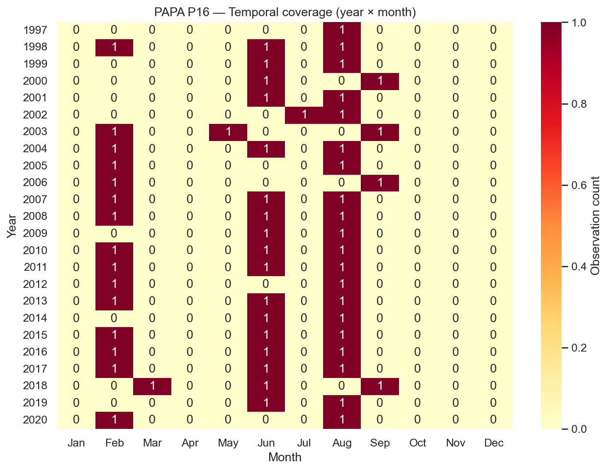
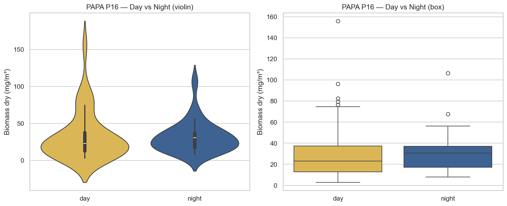
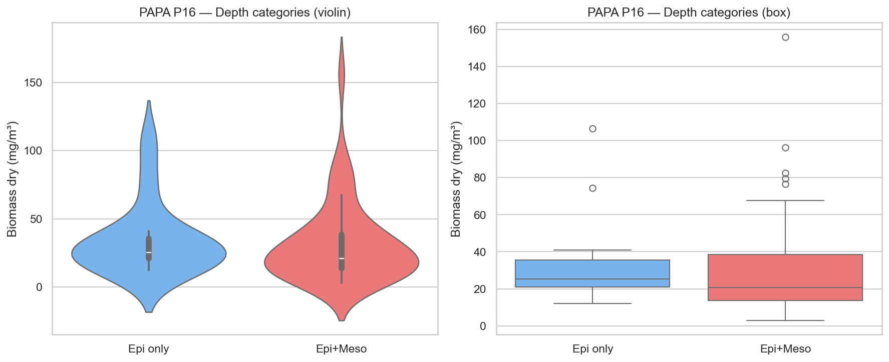
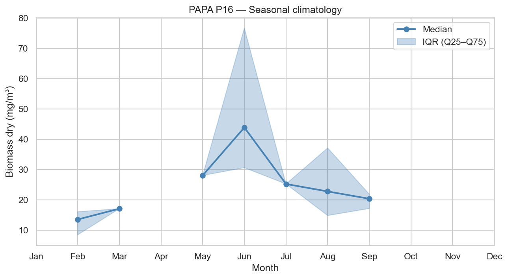
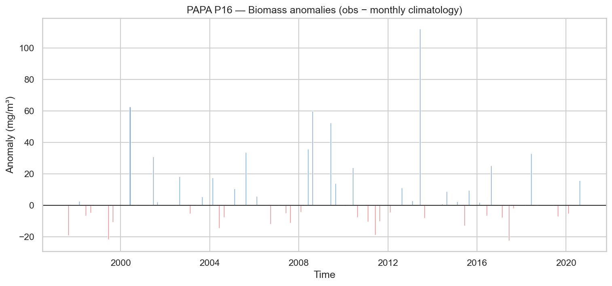
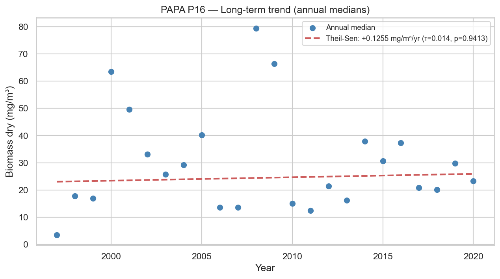

# Statistical Analysis — PAPA P16

**Station**: papa_P16  
**Source**: `papa_P16_obs.nc`  
**Observations**: 59 (after dropping NaN biomass)  
**Period**: 1997-08-31 to 2020-08-17  

---

## 1. Outlier Detection (IQR × 1.5)

- Total observations: 59
- Outliers detected: 7
- Outlier fraction: 11.9%
- Biomass Q1: 15.0540 mg/m³
- Biomass Q3: 37.8625 mg/m³

## 2. Temporal Coverage

- Year range: 1997–2020
- Months with 0 observations (gaps): 229
- Median monthly observation count: 1.0

## 3. Day/Night Bias

| Metric | Day | Night |
|--------|-----|-------|
| N | 34 | 25 |
| Median (mg/m³) | 23.0271 | 30.6341 |
| Mean (mg/m³) | 32.6634 | 31.6025 |

- Night/Day median ratio: 1.33
- Mann-Whitney U p-value: 0.3077

## 4. Depth Category Bias

| Metric | Epipelagic only | Epi + Mesopelagic |
|--------|----------------|-------------------|
| N | 14 | 45 |
| Median (mg/m³) | 25.2585 | 20.7982 |
| Mean (mg/m³) | 34.3628 | 31.5454 |

- Meso/Epi median ratio: 0.82
- Mann-Whitney U p-value: 0.3056

## 5. Seasonal Climatology

Monthly median biomass (mg/m³):

| Month | Median | Q25 | Q75 | N |
|-------|--------|-----|-----|---|
| Jan | N/A | N/A | N/A | 0 |
| Feb | 13.5679 | 8.5148 | 16.0990 | 15 |
| Mar | 17.1196 | 17.1196 | 17.1196 | 1 |
| Apr | N/A | N/A | N/A | 0 |
| May | 28.0798 | 28.0798 | 28.0798 | 1 |
| Jun | 43.8866 | 30.6341 | 76.6163 | 17 |
| Jul | 25.2614 | 25.2614 | 25.2614 | 1 |
| Aug | 22.8047 | 14.8620 | 37.1215 | 20 |
| Sep | 20.3909 | 17.1870 | 21.8917 | 4 |
| Oct | N/A | N/A | N/A | 0 |
| Nov | N/A | N/A | N/A | 0 |
| Dec | N/A | N/A | N/A | 0 |

## 6. Long-term Trend

- Number of years: 24
- Theil-Sen slope: +0.1255 mg/m³/year
- Mann-Kendall τ: 0.014
- Mann-Kendall p-value: 0.9413

---

*Report generated by `src/core/analyze_station.py`*