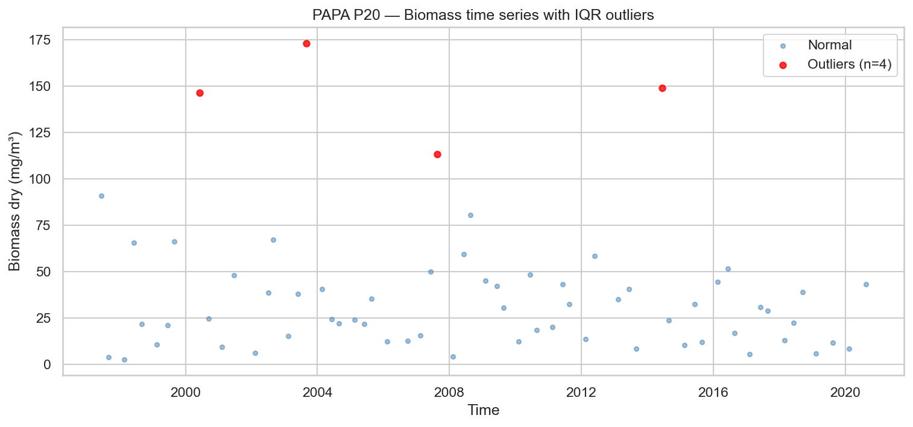
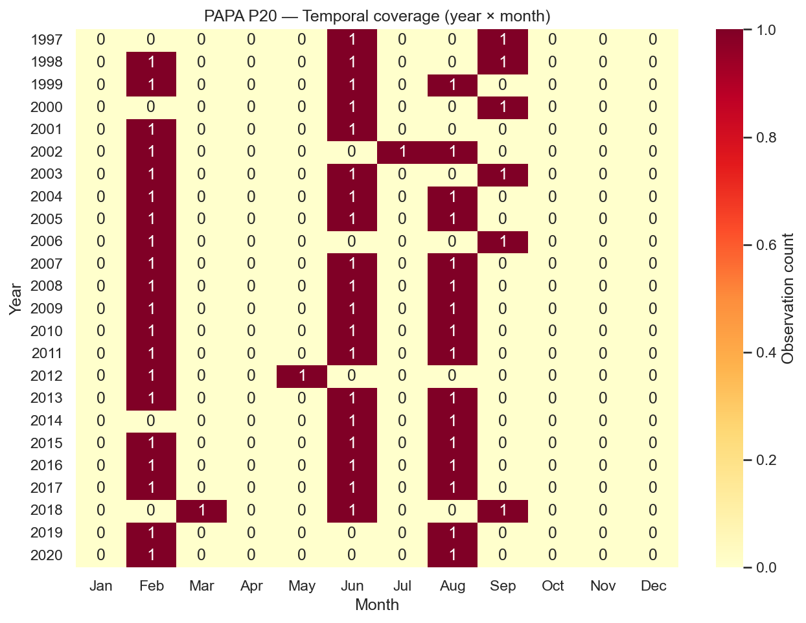
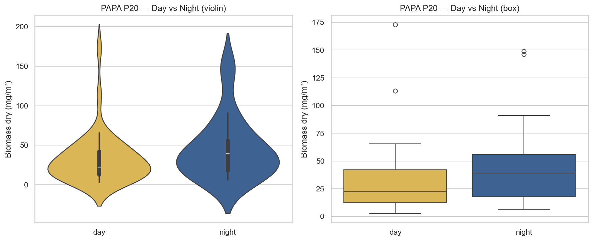
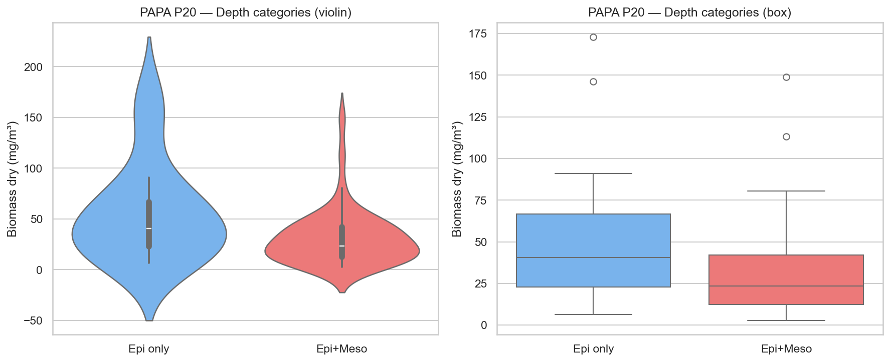
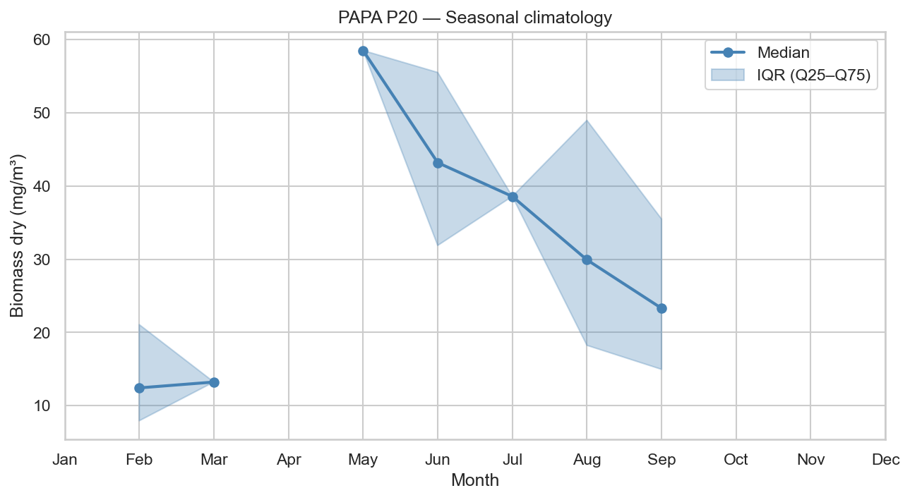
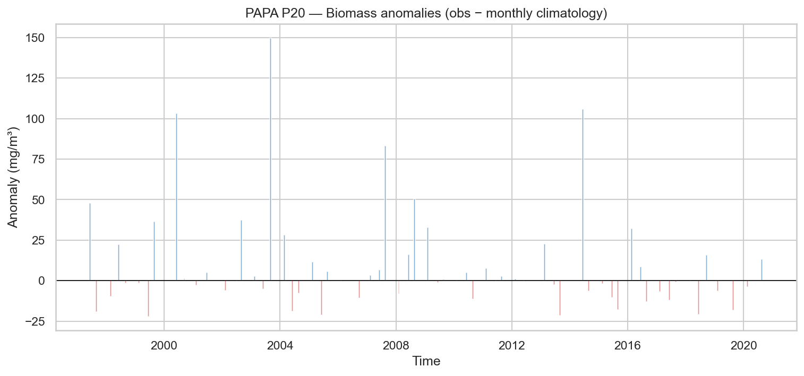
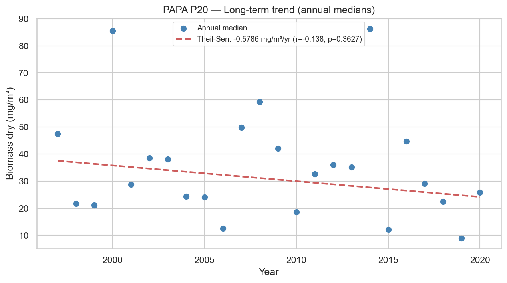

# Statistical Analysis — PAPA P20

**Station**: papa_P20  
**Source**: `papa_P20_obs.nc`  
**Observations**: 64 (after dropping NaN biomass)  
**Period**: 1997-06-12 to 2020-08-18  

---

## 1. Outlier Detection (IQR × 1.5)

- Total observations: 64
- Outliers detected: 4
- Outlier fraction: 6.2%
- Biomass Q1: 13.0949 mg/m³
- Biomass Q3: 44.8375 mg/m³

## 2. Temporal Coverage

- Year range: 1997–2020
- Months with 0 observations (gaps): 224
- Median monthly observation count: 1.0

## 3. Day/Night Bias

| Metric | Day | Night |
|--------|-----|-------|
| N | 41 | 23 |
| Median (mg/m³) | 22.4071 | 39.0413 |
| Mean (mg/m³) | 32.1670 | 45.6560 |

- Night/Day median ratio: 1.74
- Mann-Whitney U p-value: 0.1272

## 4. Depth Category Bias

| Metric | Epipelagic only | Epi + Mesopelagic |
|--------|----------------|-------------------|
| N | 15 | 49 |
| Median (mg/m³) | 40.6790 | 23.6227 |
| Mean (mg/m³) | 56.3480 | 31.0962 |

- Meso/Epi median ratio: 0.58
- Mann-Whitney U p-value: 0.0394 (*)

## 5. Seasonal Climatology

Monthly median biomass (mg/m³):

| Month | Median | Q25 | Q75 | N |
|-------|--------|-----|-----|---|
| Jan | N/A | N/A | N/A | 0 |
| Feb | 12.4301 | 7.9417 | 21.0678 | 20 |
| Mar | 13.2278 | 13.2278 | 13.2278 | 1 |
| Apr | N/A | N/A | N/A | 0 |
| May | 58.4914 | 58.4914 | 58.4914 | 1 |
| Jun | 43.1801 | 31.8738 | 55.4975 | 19 |
| Jul | 38.5695 | 38.5695 | 38.5695 | 1 |
| Aug | 29.9135 | 18.2372 | 48.9605 | 16 |
| Sep | 23.2972 | 14.9610 | 35.4908 | 6 |
| Oct | N/A | N/A | N/A | 0 |
| Nov | N/A | N/A | N/A | 0 |
| Dec | N/A | N/A | N/A | 0 |

## 6. Long-term Trend

- Number of years: 24
- Theil-Sen slope: -0.5786 mg/m³/year
- Mann-Kendall τ: -0.138
- Mann-Kendall p-value: 0.3627

---

*Report generated by `src/core/analyze_station.py`*