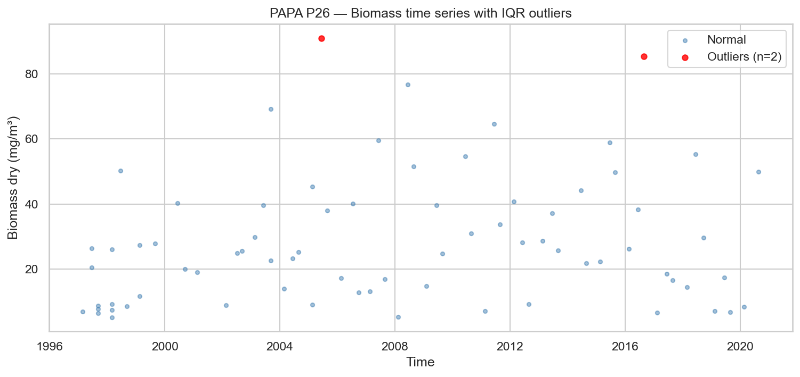
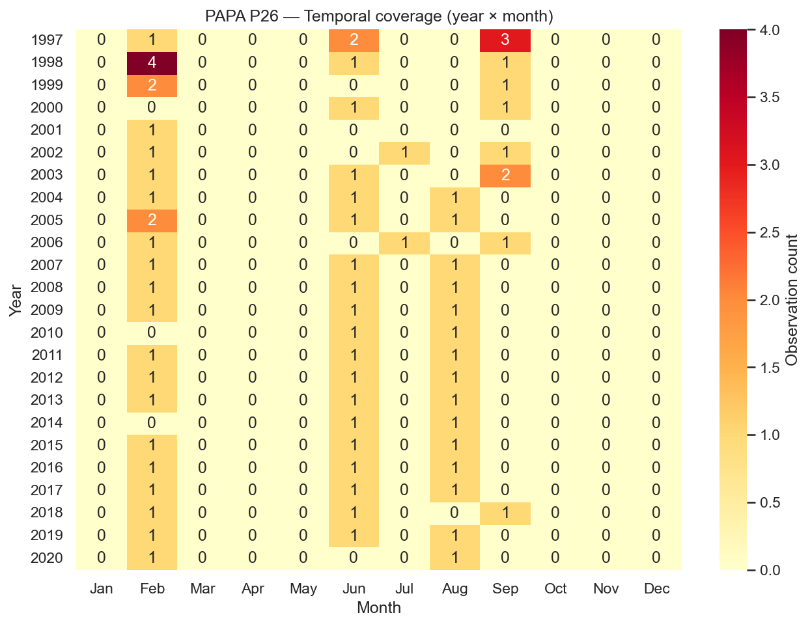
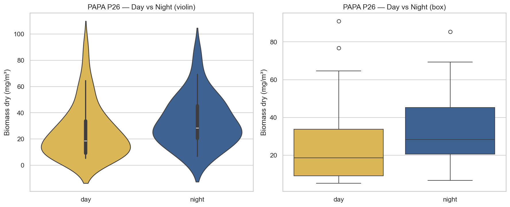
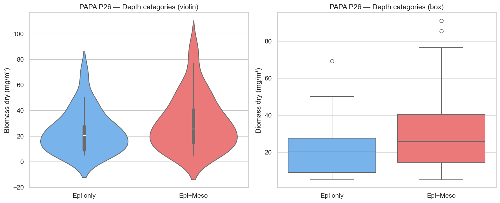
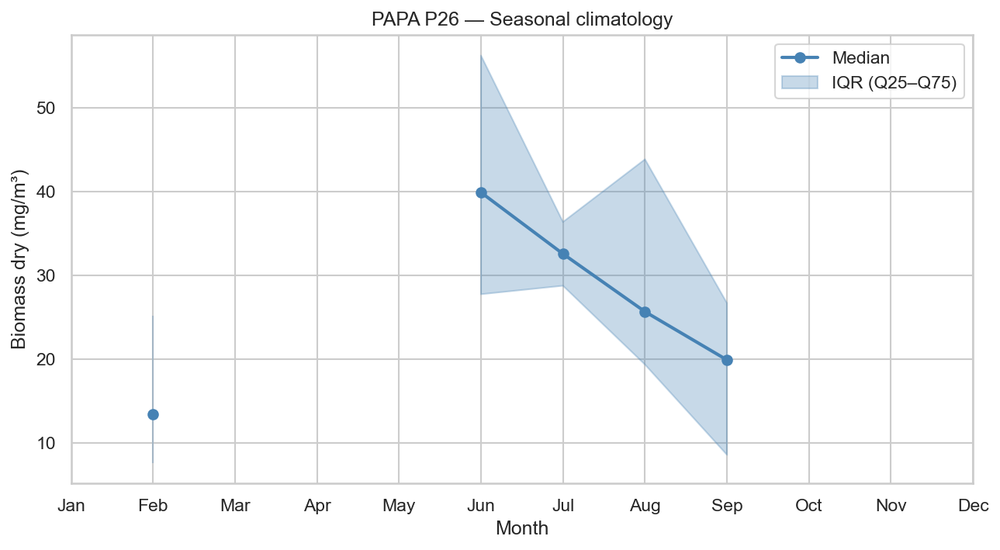
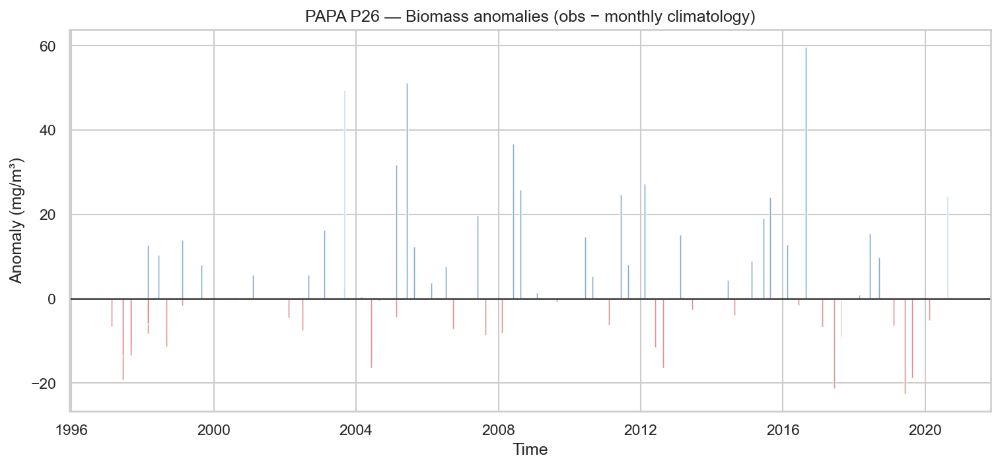
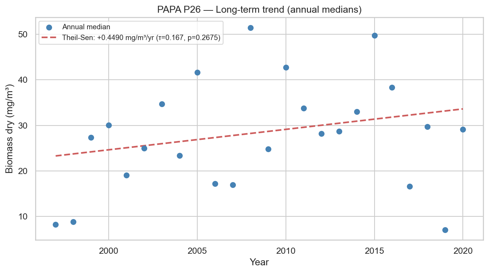

# Statistical Analysis — PAPA P26

**Station**: papa_P26  
**Source**: `papa_P26_obs.nc`  
**Observations**: 74 (after dropping NaN biomass)  
**Period**: 1997-02-21 to 2020-08-20  

---

## 1. Outlier Detection (IQR × 1.5)

- Total observations: 74
- Outliers detected: 2
- Outlier fraction: 2.7%
- Biomass Q1: 12.8156 mg/m³
- Biomass Q3: 39.5514 mg/m³

## 2. Temporal Coverage

- Year range: 1997–2020
- Months with 0 observations (gaps): 223
- Median monthly observation count: 1.0

## 3. Day/Night Bias

| Metric | Day | Night |
|--------|-----|-------|
| N | 45 | 29 |
| Median (mg/m³) | 18.5482 | 28.2236 |
| Mean (mg/m³) | 25.3646 | 33.2468 |

- Night/Day median ratio: 1.52
- Mann-Whitney U p-value: 0.0364 (*)

## 4. Depth Category Bias

| Metric | Epipelagic only | Epi + Mesopelagic |
|--------|----------------|-------------------|
| N | 23 | 51 |
| Median (mg/m³) | 20.5365 | 25.6701 |
| Mean (mg/m³) | 23.5473 | 30.6662 |

- Meso/Epi median ratio: 1.25
- Mann-Whitney U p-value: 0.2428

## 5. Seasonal Climatology

Monthly median biomass (mg/m³):

| Month | Median | Q25 | Q75 | N |
|-------|--------|-----|-----|---|
| Jan | N/A | N/A | N/A | 0 |
| Feb | 13.4893 | 7.6590 | 25.1606 | 26 |
| Mar | N/A | N/A | N/A | 0 |
| Apr | N/A | N/A | N/A | 0 |
| May | N/A | N/A | N/A | 0 |
| Jun | 39.8755 | 27.7458 | 56.1882 | 20 |
| Jul | 32.5594 | 28.7556 | 36.3632 | 2 |
| Aug | 25.6701 | 19.3648 | 43.8300 | 15 |
| Sep | 19.9202 | 8.6124 | 26.6980 | 11 |
| Oct | N/A | N/A | N/A | 0 |
| Nov | N/A | N/A | N/A | 0 |
| Dec | N/A | N/A | N/A | 0 |

## 6. Long-term Trend

- Number of years: 24
- Theil-Sen slope: +0.4490 mg/m³/year
- Mann-Kendall τ: 0.167
- Mann-Kendall p-value: 0.2675

---

*Report generated by `src/core/analyze_station.py`*