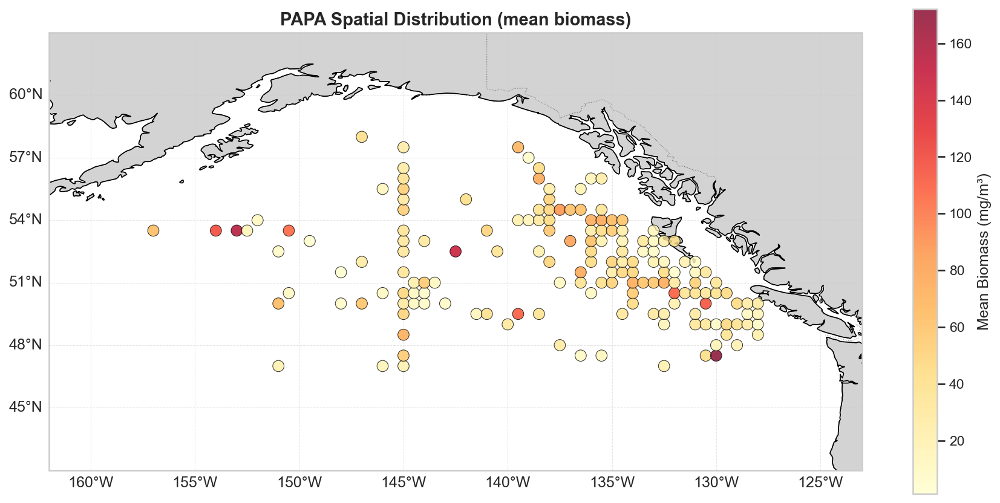
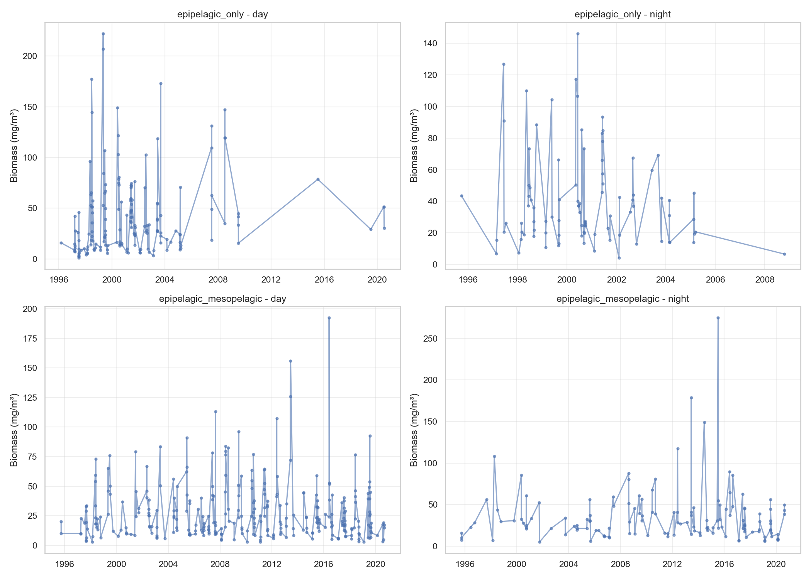

# PAPA Station Report

**Date**: 2026-02-19 10:51:39
**Region**: North Pacific (47.0-57.9°N, -156.8--128.1°W)

## Summary

- Initial rows: 1,077
- Final observations: 820
- Unique tows: 861
- Period: 1995-09-24 to 2020-08-31
- Spatial cells (0.5°): 161

### Exclusions

- Depth <50m: 16 rows
- Adult polychaetes: 3 taxa columns (benthic species)

### Depth Categories

- Epipelagic only (≤150m): 324 observations
  - Mean tow depth: 141.4m
- Epipelagic + Mesopelagic (>150m): 496 observations
  - Mean tow depth: 241.4m

### Biomass Statistics

| Metric | Mean | Median | Min | Max |
|--------|------|--------|-----|-----|
| Dry Weight (mg/m³) | 34.95 | 24.69 | 1.15 | 274.83 |

## Figures

## Methodology

**Sampling Method**: Oblique tows from surface to maximum depth

**Net**: Bongo (majority) with 236 µm mesh

**Taxonomic Groups**: 91 planktonic taxa (94 total - 3 benthic polychaetes)

**Spatial Resolution**: 0.5° grid

**Aggregation**:
1. Sum of 91 taxa per tow
2. Median of tows per day/depth_category/spatial_cell

## Points d'attention et biais potentiels

### 1. Hétérogénéité spatiale (multi-stations)

- **Type** : 314 stations différentes (vs station fixe pour HOT/BATS)
- **Couverture** : Pacifique Nord-Est (46-58°N, -158 à -128°W)
- **Stations principales** : P26 (110 obs), P12 (71 obs), P08 (69 obs)
- **Impact** : Mélange de conditions océanographiques différentes (côtier vs offshore, fronts, upwelling). Difficulté à distinguer variabilité temporelle vs spatiale.
- **Mitigation** : Agrégation spatiale 0.5° pour réduire l'hétérogénéité locale

### 2. Variabilité des profondeurs de trait

- **Profondeur médiane** : 239m
- **Protocoles standards** : 150m (204 traits) et 250m (239 traits)
- **Variabilité** : 50-295m (écart-type 55m)
- **Impact** : Les traits peu profonds (<150m) échantillonnent uniquement l'épipélagique, les traits profonds (>150m) intègrent le mésopélagique. Comparaisons temporelles sensibles aux changements de protocole.
- **Mitigation** : Catégorisation en 2 groupes (≤150m, >150m) pour séparer les profils verticaux

### 3. Exclusion des polychètes adultes benthiques

- **Taxa exclus** : 3 catégories de polychètes adultes (ANNE:POLY s1, s2, s3)
- **Justification** : Organismes benthiques (vivent sur le fond), captures accidentelles lors des traits obliques
- **Conservés** : Larves de polychètes (ANNE:POLY larvae s1) - pélagiques
- **Impact** : Sous-estimation minime de la biomasse pélagique réelle, mais meilleure représentation du zooplancton strictement pélagique

### 4. Exclusion des traits aberrants (<50m)

- **Exclus** : 16 traits avec profondeur <50m
- **Justification** : Écart majeur avec protocoles standards (150m, 250m), potentiels problèmes techniques ou côtiers
- **Impact** : Perte d'information sur la couche superficielle, mais amélioration de la cohérence du jeu de données

### 5. Hétérogénéité des engins

- **Type dominant** : Bongo (79.3%), maille 236µm
- **Autres types** : Ring, SCOR (20.7%)
- **Mailles** : Majorité 236µm (cohérent HOT/BATS 202µm), minorité 253-335µm
- **Impact** : Efficacité de capture potentiellement différente selon le type de filet. Mailles plus grandes (>250µm) sous-échantillonnent les petits copépodes.
- **Non corrigé** : Pas de facteur de correction appliqué

### 6. Classification jour/nuit

- **Méthode** : Colonne 'Twilight' dans les données brutes (Daylight vs Night)
- **Critère** : Probablement basé sur heure locale et/ou observations visuelles
- **Distribution observée** : 74.4% jour vs 25.6% nuit
- **Biais** : Déséquilibre jour/nuit, campagnes potentiellement concentrées sur une période diurne

### 7. Résolution taxonomique élevée

- **Avantage** : 91 taxa planctoniques identifiés (vs biomasse totale pour HOT/BATS)
- **Limitation** : Somme des taxa ne capture pas les interactions trophiques ou la structure de taille
- **Cohérence** : Conversion en biomasse sèche totale pour comparabilité inter-stations

### 8. Couverture temporelle et spatiale

- **Période** : 1995-2020 (26 ans)
- **Échantillonnage** : Irrégulier dans le temps et l'espace
- **Cellules spatiales** : 161 cellules 0.5° occupées
- **Biais potentiel** : Concentration des observations près de stations récurrentes (P26, P12), représentativité régionale à vérifier

