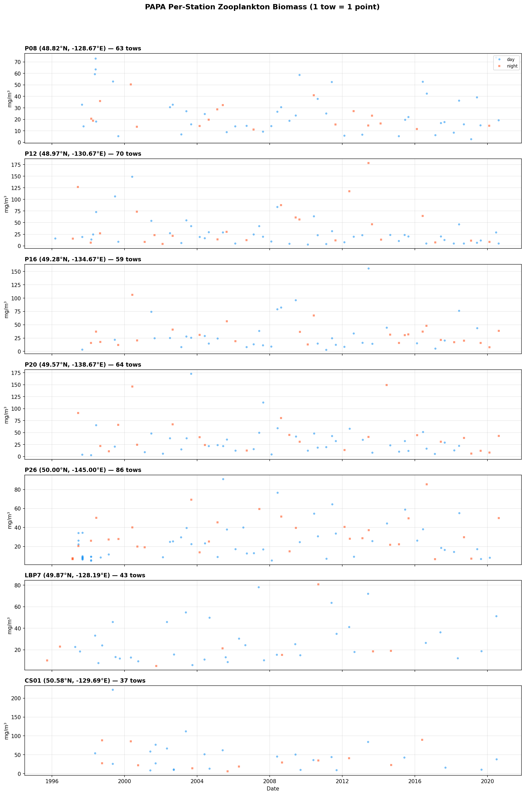

# PAPA Per-Station Report

**Date**: 2026-03-04 13:36:35
**Stations**: 7

## Summary

- Initial rows (all stations, after depth filter): 1,061
- Stations processed: P08, P12, P16, P20, P26, LBP7, CS01
- Total final tows: 422

## Stations

| Station | Rows | Tows | Lat | Lon | Period |
|---------|------|------|-----|-----|--------|
| P08 | 69 | 63 | 48.82 | -128.67 | 1997-08-29 to 2020-08-14 |
| P12 | 71 | 70 | 48.97 | -130.67 | 1996-03-06 to 2020-08-15 |
| P16 | 59 | 59 | 49.28 | -134.67 | 1997-08-31 to 2020-08-17 |
| P20 | 64 | 64 | 49.57 | -138.67 | 1997-06-12 to 2020-08-18 |
| P26 | 110 | 86 | 50.00 | -145.00 | 1997-02-21 to 2020-08-20 |
| LBP7 | 43 | 43 | 49.87 | -128.19 | 1995-09-28 to 2020-06-30 |
| CS01 | 37 | 37 | 50.58 | -129.69 | 1998-05-17 to 2020-07-05 |

### Biomass Statistics (mg/m³)

| Station | Mean | Median | Min | Max |
|---------|------|--------|-----|-----|
| P08 | 25.52 | 19.61 | 2.81 | 73.77 |
| P12 | 33.03 | 20.56 | 2.92 | 178.60 |
| P16 | 32.21 | 24.14 | 2.91 | 156.03 |
| P20 | 37.01 | 26.98 | 2.83 | 173.04 |
| P26 | 26.37 | 22.43 | 5.17 | 91.02 |
| LBP7 | 27.30 | 19.02 | 5.09 | 80.73 |
| CS01 | 45.13 | 36.11 | 6.10 | 222.30 |

## Figures

## Methodology

**Source**: DFO Canada Zooplankton Database

**Net**: Bongo (majority) with 236 µm mesh

**Taxonomic Groups**: 91 planktonic taxa (94 total - 3 benthic polychaetes)

**Aggregation**: Mean of taxa per tow (no L2 median)

**Output format**: 1 row = 1 tow (Parquet)

**Coordinates**: Median lat/lon per station (fixed point)

## Output Files

- `papa_P08_obs.parquet`
- `papa_P12_obs.parquet`
- `papa_P16_obs.parquet`
- `papa_P20_obs.parquet`
- `papa_P26_obs.parquet`
- `papa_LBP7_obs.parquet`
- `papa_CS01_obs.parquet`

